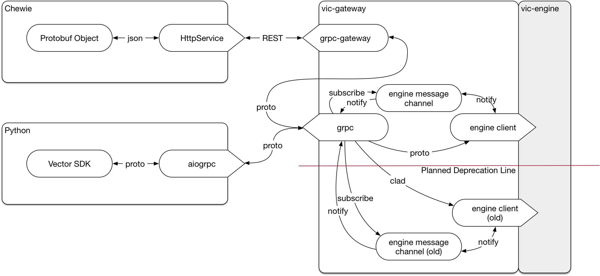

# Victor Gateway
Created by Shawn Blakesley Last updated Oct 03, 2018

## Purpose

Victor gateway is the primary point of contact for the SDK to the robot. Wi-Fi messages from Chewie and the Python SDK will both route through vic-gateway before being translated as needed to the internals of vic-engine. This provides a single external interface to maintain for requests coming to the robot.

gRPC is an http2 protocol for defining an interface from a generated file, and communicating over that interface with Protobuf messages. This allows us to expose our SDK by exporting a set of proto files to our users. With the proto files, a user should be able to implement a basic sdk interface in any language that supports grpc. For languages that do not support gRPC, there is a REST API that interprets messages from JSON rest calls to Protobuf gRPC calls (this is the case for chewie).

## Architecture

For Chewie, messages sent using a standard http protocol to pass JSON to the grpc-gateway part of vic-gateway. These messages will be generated from Protobuf classes that have been slightly modified to not include Protobuf serialization (for space and build speed considerations).

For Python, messages will be sent via aiogrpc which is an asynchronous wrapper for gRPC. This allows the python code to talk directly with vic-gateway's gRPC handlers. The actual calls will still be wrapped under the design of the Vector SDK, but in theory could be used directly if not implemented by the team.

Once messages get to the gRPC handlers, old messages are converted from Protobuf to CLAD and passed to the engine via a domain socket. Newer messages are only modified as needed for versioning. For messages coming back from the engine, there will be a channel by which the messages are fanned out to waiting listeners, and processed be the handlers themselves.

## Events

Events are unsolicited details about the robot's state. This includes things such as Victor's current status, the world state, and anything else we don't explicitly ask for via an RPC. There's a distinction between events and RPC responses. RPC responses are the result of messages being sent to the robot and the robot replying, but events are not directly asked for (other than via an Events request).

