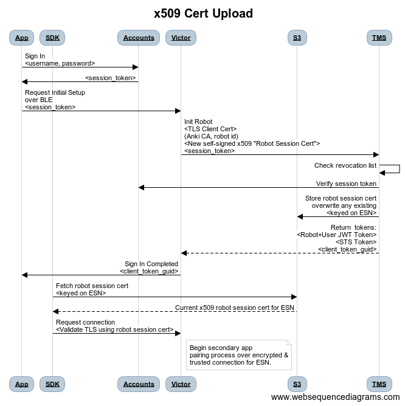

# Victor SDK Connection Authentication

Created by Shawn Blakesley Last updated Jun 07, 2018

## Prior Work

Victor Cloud Token Management : The current plan from the cloud side of things for authentication of an owner applications and SDK to a robot.

## Problem Space
We're looking to establish a connection from the robot to either a phone app or computer using the Victor SDK.

For this connection we'll need to establish a couple forms of trust:

1. We need to establish a secure connection to a robot with some assurance that a user is talking directly to their robot (such as a x509 cert), without any "man in the middle" able to intercept or alter data in transit.
2. We need to verify that the user connecting to the robot has authorized access to the robot (using an access token).
Connections to the robot can be established by bluetooth and over wifi.

## Solutions for Secure Connection
We can establish a secure connection using TLS as long as the client (Chewie/SDK) has a means of trusting the certificate presented to it by the robot.

There are a few ways this trust can be established:

### Anki-Signed Robot Certificate
Each robot is issued with an x509 certificate that identifies the robot with its ESN in the CN (common name) field of the certificate.  The certificate is added to the filesystem at the factory and is signed with an Anki Certificate Authority (CA).  This CA's public certificate could be added to clients that need to communicate with the robot  as a trusted root.

#### Advantages
* Trusted certificate, signed by Anki - No need to transfer certificates out of band greatly simplifying both client and robot code to establish a secure channel.
* Certificate uniquely identifies each robot; provides an assurance that the client is talking to the expected robot
* Infeasible for malicious users to forge a robot certificate, assuming we keep the CA private key secure.
* No man-in-the-middle attack vector, assuming attackers cannot get a copy of the robot's certificate private key (see below)

#### Disadvantages
* Escalates the trust level of the certificate - It's currently only used during server requests to provide a hint that the request is coming from an Anki issued robot, and the ESN associated with it; it is not used to provide transport security:  The ramifications of it being forged or duplicated are very limited.  This would not be true in this context.
* The robot is not using a secure enclave to store the private key, meaning anyone with physical access to the robot could potentially extract the private key from the filesystem and clone the certificate - This would present an undetectable man-in-the-middle attack vector.  A practical example of this would be a lab-issued robot, where multiple people would have an opportunity to create such a clone and then intercept the communication of whomever is issued the same robot in the future.

### Robot-Signed Certificate via BLE
During initial setup (and after each reset/change of ownership) the robot would generate a unique self-signed "Robot Session" x509 certificate.  The private key for this certificate is stored only on the robot and is never transferred elsewhere.

A client initially opens a secure and trusted connection (as verified by PIN) over bluetooth and retrieves the public certificate from the robot at this time.  The client can then use the robot's certificate to securely open a TLS connection to the robot over wifi, providing both encryption and verification of remote identity preventing a man in the middle attack.

#### Advantages
* Does not require the Anki-issued robot certificate to be trusted
* Generates a new certificate on each reset, removing the possibility of a previous owner of the robot being able to intercept the communication of future owners; an attacker in a lab scenario will find themselves with an out-of-date certificate as soon as the robot is reset and assigned to someone else.
* Relatively simple to implement for Chewie/SDK
* Standard TLS web-socket connection using the certificate; no new crypto work required.
* Does not require any new cloud functionality to be implemented.

#### Disadvantages
* Requires robot code to generate and store the self-signed certificate after reset
* Requires the client and robot to agree on transfer of the certificate
* Does not provide a mechanism for clients without bluetooth access to open a secure connection by wifi only (see below); SDK users will still need bluetooth, or some other way of retrieving the robot's self-signed certificate.

#### Verdict
This is ideal for the cloud, and will be the starting point while work is done to manage the public keys in the key store.

### Robot-Signed Certificate via Cloud
As above, the robot will generate a self-signed Robot Session certificate, but in addition to making it available via BLE, it will also upload the public certificate to an Anki certificate store as part of the initial token service handshake, keyed by the robot's ESN.

Future clients wishing to connect to the robot via wifi only (eg. because they don't have bluetooth available) can retrieve the certificate from the Anki certificate store and use it to open a secure and verified connection to the robot. 

As the certificate is not sensitive information, it can be distributed to anyone requesting it, allowing secondary users to also open secure connections to the robot without needing to know anything other than the ESN of the robot it wishes to connect to.

### Advantages
* No BLE requirement (the client must have some method for ensuring it knows which robot ESN it wishes to communicate with, however, which must itself be transmitted securely to avoid MITM)
* Reduced SDK complexity
* Simple for clients to access the public key, assuming Internet access.
* Limits feasibility of a man in the middle attack - as a new certificate is generated every time the robot is reset, an attacker in a lab scenario will find themselves with an out-of-date certificate as soon as the robot is reset and assigned to someone else.

### Disadvantages
* Requires new cloud infrastructure for a certificate store (potential additional TMS function, though storage could literally be an S3 bucket)
    * The state store is not a good place to put this; it should ideally be available to non-authenticated users so we don't block the path to secondary users (we were also not intending to store blobs in this store)
    * If the certificate store is keyed on ESN, the store must have a high degree of confidence the submitter is authoritative for that ESN.  The easiest way to do this is to incorporate it into the TMS associate primary user flow:  This requires the submitter to have an Anki-issued certificate for that robot.  Someone cloning the robot's certificate would be able to trigger a re-association, but will invalidate existing use of the robot by the existing user; inconvenient, but not a security vulnerability.
    * An alternative to keying certificates purely on ESN, would be to key on (primary user_id, ESN), however secondary clients would then have to be able to securely discover (or be told) the primary user id.
* Unnecessary for the chewie app because they will have a BLE connection and could request the certificate directly from the robot over this channel
* Requires additional robot code to generate certificates and transmit for storage on the server

Security Note:  The SDK must know the ESN of the robot it's connecting to up front, and request the certificate for that ESN from the certificate store - As it does not at that point have a trust relationship with the robot, it cannot just connect to its IP address and request the ESN at that point.

### Verdict
This is the ideal solution for the SDK. Due to limited support for BLE on many platforms and the possibility of a platform not having BLE, this would mean those devices would still be viable for connecting via the SDK.

The difficulty for this implementation lies on the side of the cloud. They would need to manage and distribute public certificates for robots.

Due to the current timeline for the cloud team, this will be the goal for the python sdk, and will replace the BLE implementation when it is available.

## Solutions for Access Token

We need to provide an access token to the robot that verifies an SDK User is allowed to access the robot.

For this we will essentially be following the Secondary App Association by Primary User flow on page 15 of the Victor Cloud Token Management Doc (see above).

The user will log in, be given a user session token, and provide that token when opening communication with the robot.

If the token is accepted, the robot will provide a client token guid to be used as an access token for future connections.