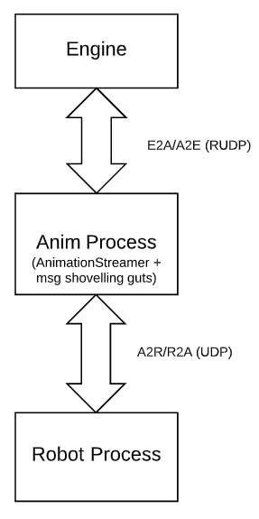

# V2 Animation System

Created by Kevin Yoon Jun 23, 2017

Notes from AnimationController Refactor Summit of June 23, 2017

The newly proposed solution looks like this.

The topology is similar in many ways to that of V1. Just as the Espressif used to be primarily responsible for playing animation key frames and passing along messages between Engine and K02, the proposed Anim Process would be responsible for the same thing. The difference is that Anim Process houses a simplified version of the AnimationStreamer and the buffering functions of Espressif's AnimationController are no longer needed.

This topology also allows Engine to run on a separate device from the robot (for easier debugging) and still execute animations as they would if Engine were running on the robot. The fact that Anim Process is a process, as opposed to a thread off the main engine process, also makes profiling easier and potentially enables us to apply some tricks to enforce the 33ms tic rate which would otherwise not be possible.

Anim Process is the only component that directly controls

* Face display
* wwise (audio)

Engine remains the authority of which tracks are locked (i.e. MovementComponent), but this information is sent down to Anim Process (just as they are sent to the Espressif in V1) where the track locked state is mirrored. The AnimationStreamer consults this state to appropriately block messages part of an animation that were bound for the

Anim Process normally just shovels messages from Engine to Robot Process and vice versa. For the most part it doesn't care what the messages are, but there are a few that it does react to.

* TrackLockMsg (E2A): Updates current copy of track lock states. If a track becomes locked, inserts a message to stop the corresponding track on the A2R queue.
* PlayAnimationMsg (E2A): Contains Animation ID which triggers AnimationStreamer to start playing that animation. Track commands are inserted into the A2R queue at the triggerTimes defined by the associated keyframes of that animations.
* Various E2A/A2E) AnimationStreamer set/get messages required for Engine to interact with it. (Equivalent of today's AnimationStreamer's public methods.)

Other notes:

* Animation Streamer 2.0 work will not be continued, but if the work
* This represents a bigger overhaul of AnimationStreamer than originally planned since the robot object (and other engine components) will not be accessible. The current AnimationStreamer's public functions will need to be converted to messages. Engine components that currently query the AnimationStreamer will now need to do so via messages in non-blocking ways. Engine may, for example, need to maintain something that mirrors Anim Process state.

===========================================
*Notes from AnimationController Refactor Summit of May 9, 2017*

No longer need to stream audio to robot since speaker is directly accessible from engine. There's also no latent comms channel to physical robot to deal with. AnimationController now obsolete? Do we still need something new to maintain sync between audio and motion/face keyframes?

Attendees: 

Initial proposal is to eliminate AnimationController from the robot process. Instead, the AnimationComponent will be an engine component (will probably be very similar to AnimationStreamer) that runs on its own thread at a 33ms tic. Instead of doling out keyframes to the robot process as in Cozmo v1, it calls motion commands via MovementComponent which will also run in the same thread and acts as the clearing house for all motion commands accounting for which tracks are locked. The same goes for bodyLightsComponent which will act as a clearing house for backpack light commands.

An AnimationThreadManager would own and be responsible for ticking the AnimationComponent, MovementComponent, and BodyLightComponent. Robot.Get###Component() functions could reach into AnimationThreadManager to get references. Each component will need to be updated for thread safety. Potentially need to queue operations if there's a chance they could delay the 33ms tic.

Now that more than one thread needs to send messages to robot process, need to make sure that current messaging interface is both (a) thread-safe and (b) able to send messages immediately since we can't afford delay for animations. Alternatively, we could create a separate socket for messages sent from this thread that the robot process would also listen for.

Expected order operation:
1) AnimationStreamer receives trigger to play animation which starts the animation
2) When a keyframe's trigger time is reached, one of the following occurs based on type
- BodyMotion/HeadAngle/LiftHeight: calls a MovementComponent function
- Audio: triggers wwise event (possibly with some time advance or delay to sync with other tracks)
- BackpackLights: calls a BodyLightsComponent function
- ProceduralFace/FaceAnimation: calls a face command (via AndroidHAL)
- Event: triggers E2G::AnimationEvent
- RecordHeading: locally records current heading
- TurnToRecordedHeading: executes point turn to recorded heading