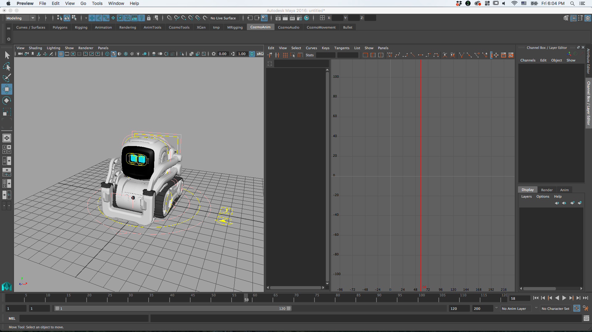
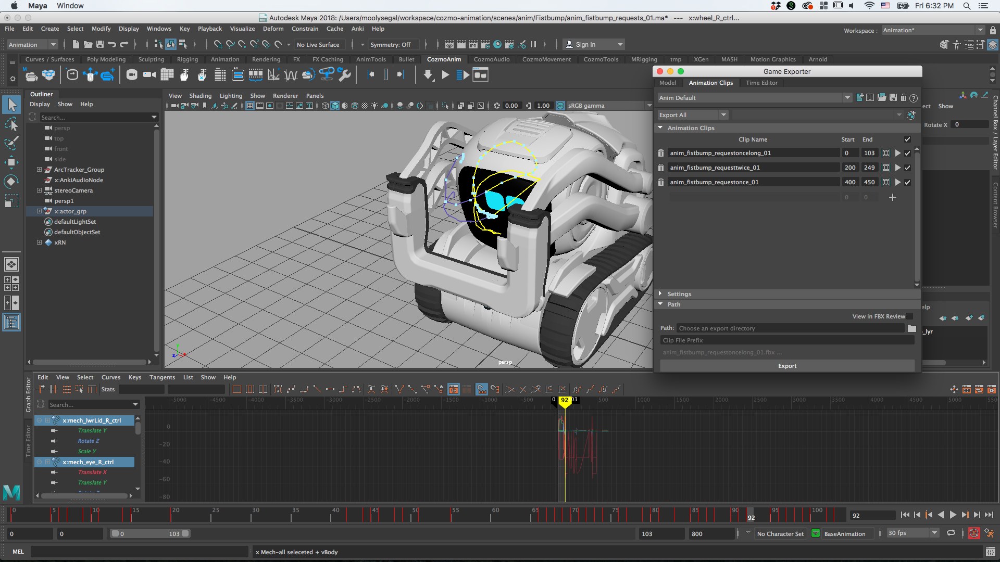

## Animations

### Quick Summary

* Animations are coordinated movements, sound, lights, and eyes
* Either "Canned" (authored by animators offline) or "Procedural" (runtime generated)
* Consist of a timeline of Tracks with individual KeyFrames at specific times, with a moving playhead which uses audio samples as its "clock"
* Generally played using `TriggerAnimationAction`
* Playback occurs in a separate animation process, with the `AnimationComponent` in the Robot providing the interface on the main thread

---

# Details

An Animation is an open-loop sequence of highly coordinated movements, faces (eyes), lights, and sounds used to demonstrate an emotion or reaction. They can be created dynamically at runtime ("procedural" animations) or they are more commonly authored by Anki's animation team in Maya and loaded from files ("canned" animations). 

The `CannedAnimationContainer` is the storage for available canned animations loaded at startup. Animations which are alternates for a similar use case are organized into an `AnimationGroup`. In code, we use an `AnimationTrigger` to select and play an animation from a group based on the robot's emotion, head angle, etc. The mapping from Triggers to Groups is in [`AnimationTriggerMap.json`](/resources/assets/cladToFileMaps/AnimationTriggerMap.json).

The Robot has an `AnimationComponent` whose counterpart in the separate animation process is the `AnimationStreamer`.

### Tracks
An animation consists of a set of `Tracks`, each comprised by a set of `KeyFrames` on a timeline. Each track controls some subsystem of the robot, such as its head, lift, or face. For Canned animations, the KeyFrames exported from Maya are stored in JSON or Flatbuffer format. Available tracks (defined by the type of KeyFrame they use):

* Head
* Lift
* BodyMotion (i.e. for controlling the treads)
* Face - one of either:
  - [ProceduralFace](proceduralFace.md) (parameterized eyes)
  - FaceAnimation (sequences of raw images)
* Audio
* Backpack Lights
* Event ("special" keyframes which can be used to indicate back to the engine where that a certain point in the animation has been reached)

All keyframes have a trigger time, in milliseconds starting when the animation starts, and most have a duration, a delta, also in milliseconds. Animations are scaled by 99% so that keyframes fall on integer boundaries, multiples of 33ms, rather than 33.33ms

### Layers
Additional tracks can be "layered" on top of a playing animation by combining them with the corresponding tracks in that animation. The `AnimationStreamer` has a `TrackLayerManager` for each track that supports layering. A notable example is the use of face, audio, and backpack light layering for the "glitchy" face the robot exhibits when the repair need is high.

### Playback
Because timing and coordination is a fundamental element of animations, they run on a very specific tick: 33 Hz. Thus, they are not played back on the main engine (or "basestation") thread, which has its own tick rate and whose timing is somewhat less critical. Instead, there is a separate animation process which is responsible for maintaining a playhead and advancing keyframes on each track as they are reached. The audio samples from WWise are used as the "clock" for the rest of the tracks when playng an `Animation`.

In Cozmo, where the engine and the robot where different physical devices, keyframes were "streamed" over Wifi to be played on the robot. Holdovers from that can still be found in the naming and buffering implementation in Victor's `AnimationStreamer`. 

### Limitations
Some limitations of the current implementation include:

 * **Gapless playback:** due to there only being one current "streaming" animation and the way the AnimationStreamer in the animation process interacts with the AnimationComponent in the Robot on the main engine thread, there are often small pauses or "hiccups" between two animations (e.g. from a one-engine-tick delay before one animation is registered to have ended and the next is set). 
 * **Automatic smooth transitions:** there is not yet any mechanism to ensure a smooth transition from the final keyframe of one animation to the starting one of the next. Therefore, care must generally be take to play animations in sequences that make and prevent noticeable jumps. This is particular try for the eyes, which can exhibit undesirable "pops".

 ---

# Content Pipeline

## Animation Authoring

Animation files and tools are stored in a separate subversion repository, setup instructions are [here](https://ankiinc.atlassian.net/wiki/spaces/COZMO/pages/73498743/Setting+up+Cornerstone+for+the+first+time).

Facial animations are created and edited in Maya; there is a rig that represents the Victor robot with manipulators for changing both face and eye parameters.

Animations are exported by the Maya Game Exporter, segments on the Maya time line are split into multiple files, exported as JSON and binaries, JSON files are further packed into .tar files.

## Animation Exporter

`cozmo-animation/trunk/tools/other/export_maya_anim.sh` is the main entry point that initializes the Maya python API and calls into the Anki Python library (`cozmo-animation/trunk/tools/pylibs/ankimaya`) that does the work.

`export_from_maya.py` takes a list of source Maya files (.ma) and calls export_for_robot() for each; when the export is complete a list of files needed to be committed to svn is reported.

`export_for_robot.py` processes keyframes and yields .tar files of JSON files. There are special cases and restrictions for each kind of keyframe, for example, lift keyframes take the first frame as the bind pose.

## Deploy

Exported animation files are pulled into the repo by [`project/victor/build-victor.sh`](../../project/victor/build-victor.sh) that issues svn commands to update from the animation repo.

During deployment only the .bin files are copied onto the robot.

# How to include new animations in the behavior system

As a behavior engineer, you're likely to be called upon to make use of new animations produced by Anki's awesome animators.
You'll typically be provided with: 
- A "DEPS number". This is simply the revision number of the Subversion repository containing animation assets, mentioned above.
- Names of one or more animation groups (see above for what an animation group is), typically named something like `ag_featurename_animationname`.

To incorporate the animations in your feature, do the following:
- In `victor/DEPS`, set the "version" number (in the "victor-animation-assets" entry under "svn", line 65 at the time of this writing) to the DEPS number provided by the animator (if it is not already equal to or greater than that number). Note that this line is prone to merge conflicts: it's likely that someone else working on a feature in parallel has also changed this line and merged to master while you were working on your feature. Pay attention when merging.
- Create new animation triggers in `victor/clad/src/clad/types/animationTrigger.clad`. (It's just a big ol' enum. Try to keep it in alphabetical order.)
- Edit `victor/resources/assets/cladToFileMaps/AnimationTriggerMap.json` to map between the animation triggers you just created and the animation groups created by the animator.
- Use the new animation triggers in your behavior.

# Webots

Key       |Effect
----------|------
Shift + I | Toggle eye rendering between Victor and Cozmo style

# Console functions, variables and webservice

For webots navigate to: <http://127.0.0.1:8889/consolevars?ProceduralFace>

For actual hardware navigate to: http://*robot ip*:8889/consolevars?ProceduralFace

Put a check against *ProcFace_OverrideEyeParams* to allow the sliders take control of the individual eyes.

*ProcFace_OverrideRightEyeParams* will force the eyes to be the same, based on the left eye.

The *ResetFace* button will reset both eyes from a bad state to the current canned animation state.

To toggle between Victor eye rendering and the original Cozmo eye rendering there are two buttons *VictorFaceRenderer* and *CozmoFaceRenderer*, clicking either will change state as appropriate.

### Console function: ListAnimations

Will list the animation names registered to the canned animation library.

e.g. `curl` <http://127.0.0.1:8889/consolefunccall?func=ListAnimations>

### Console function: PlayAnimation *name* [*numLoops*]

Takes an animation name and an optional number of loops and forces the animation process to stream it.

e.g. `curl` <http://127.0.0.1:8889/consolefunccall?func=playanimation&args=anim_rtpmemorymatch_yes_03+4>

### Console function: AddAnimation *path*

Registers an animation in the `resources/assets/animations/` folder with the canned animation containers; this allows animations to be uploaded after launch and triggered.

e.g. `curl` <http://127.0.0.1:8889/consolefunccall?func=AddAnimation&args=anim_bored_01.bin>

### Console function: CaptureFace *filename* *number of frames*

Captures each rendered face frame and saves into a .gif file, if filename is omitted the default is `eyes.gif` and the default number of frames is 1.

e.g. http://127.0.0.1:8889/consolefunccall?func=CaptureFace&args=longmovie.gif+100

If viewed from a browser a hyperlink to the captured .gif is displayed, the link is only valid after the capture is complete. There is no notification. Additionally you may need to refresh the page.

# playanimation.py

`playanimation` is a tool for previewing and debugging animations for Victor. As a preview tool it allows animation files to be uploaded to the robot or simulator and triggered to play. These animations remain with the robot/simulator and can replace existing content, they can also be replayed via the webserver. This is referred to as playing "on robot".

As a debugging tool animations can be played entirely on a development machine where state can be easily inspected and dumped, iteration time for the python code is very immediate. These results can then be compared on a robot or simulator by using the webservice to update the procedural face with frames generated on the development PC. This is referred to as playing "on host".

Long name  |Short|Description
-----------|-----|-----------
--target   |-t   |Play the animation on the robot or host, default is host'
--ipaddress|-i   |Optional IP address or robot or localhost for webots. If omitted will output to the console.
--file     |-f   |Animation file, only JSON is supported for playing on the host
--animation|-a   |Name of animation within JSON/.bin file
--realtime |-r   |Drive the animation on the host either at a fixed frame rate or real-time, default is a fixed 33ms frame

To play an animation in the simulator:

`python playanimation.py --target robot --ipaddress 127.0.0.1 --file hotspot_interpolation.json --animation eye_test`

To play an animation on the robot or simulator:

`python playanimation.py --target robot --ipaddress 192.168.1.212 --file hotspot_interpolation.json --animation eye_test`

To play an animation on the host and update the robot or simulator face via the webservice

`python playanimation.py --target host --ipaddress 127.0.0.1 --file hotspot_interpolation.json --animation eye_test`

To play an animation on the host and print face values to the console:

`python playanimation.py --target host --file hotspot_interpolation.json --animation eye_test`
