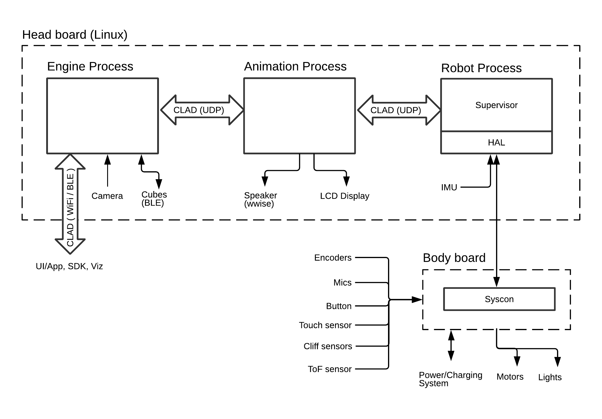

# Victor Architecture Overview

## Quick Summary
* 3 main processes
  * Engine
     * Actions and behaviors
     * Cube lights and accelerometer (via BLE)
     * Localization
     * Mapping
     * Path planning
     * Sensor processing
     * Vision
  * Animation
    * Playing animations and audio
    * Face display
    * Processing (microphone) sounds
  * Robot
    * Docking
    * LEDs
    * Motor control
    * Path following
* Communicate via CLAD messages
* Components
* Coretech: Anki's robotics library

For a high-level hardware and software overview go [here](https://ankiinc.atlassian.net/wiki/spaces/VD/pages/128352510/Victor+Prototype+Notes)

## Processes

Victor's application processor runs 3 primary processes: [engine](#Engine), [animation](#Animation), and [robot](#Robot) processes. They are automatically initiated and connected when the robot powers up.

### Engine

The engine is the "main" process on Victor. Just as in Cozmo, it is responsible for most of the high-level and/or computationally-intensive operations. It is ticked every 60ms, but it's not necessarily detrimental to performance if the timing were to waver occasionally... not that we should purposely let it!

| Component           | Description |
| --------------------- |-------------|
| ActionContainers           | Manages running and queued actions |
| AnimationComponent    | Interface to Animation Process functions (incl. playing animations and displaying images on face) |
| BehaviorComponent      | Manages selection and execution of behaviors      |
| BlockWorld                     | Maintains pose knowledge of cubes and other observable objects that have fiducial markers |
| CliffSensorComponent   | Cliff detections, dynamic threshold adjustments
| Cube(Comms/Accel/Light)Component | Various components responsible for communicating with cubes (BLE), controlling their lights, and processing accelerometer data streamed from them |
| ExternalInterface            | Interface for sending/receiving messages from UI/App/SDK |
| FaceWorld                      | Registers faces for recognition, maintains pose estimates of any observed faces |
| MovementComponent   |  Interface for moving the robots various motors. In general, if you want to move the robot you should be using actions! |
| Navmap                         | Occupancy map storing knowledge of objects and features of interest including those detected by proximity sensors or camera
| PathComponent            | Generates paths to get robot from one pose to another. Depending on the planner, it may generate plan in a separate thread from the main thread. |
| PetWorld                       | Maintains poses of observed pet faces |
| RobotStateHistory        | Maintains a limited history of robot poses (as reported by RobotState message) and is used to compensate for comms latency in order to compute accurate robot and marker poses. |
| RobotEventHandler      | Manages messages from UI/App that don't have dedicated components handling them |
| RobotToEngineImplMessaging | Manages messages from Robot and Anim process that don't  have dedicated components handling them |
| VisionComponent         | Captures camera images and processes them according to enabled vision modes (e.g. Find markers, find faces, etc.) Runs in a separate thread since it's possible processing could exceed engine tick time. |
| VizManager                   | Delivers visualization data to any interested clients |

### Animation

This process is primarily responsible for loading [animations](animations.md) and executing them when commanded by the engine.

For historical reasons, the tic rate is 33ms, which is the finest resolution of an animation frame in Cozmo. By maintaining the same rate, Cozmo animation assets can be played on Victor with "identical" performance. It is thus critical to animation playback fidelity that this 33ms tick be reliable.

The animation process is also responsible for

* Processing microphone data
  * Signal Essence and Sensory (3rd party libs) used for directionality and keyword detection (respectively)
  * In order to minimize the transfer overhead of a significant amount of data, this data is processed here because it's the lowest level process that has sufficient tic time to do it
* Playing all audio
  * whether triggered by an animation keyframe or a message (e.g. Text-to-Speech) from engine
  * Uses Wwise audio system
* Face display
  * Animation keyframes
  * Arbitrary images sent from engine or internal debug menu system
* Relaying messages between engine process and robot process
  * Messages travel through the animation process instead of going direct in order to maintain message order/sync that both proceses rely on

### Robot

Ambiguously named for historical reasons, the contents of this process encompass the highest level code that used to run on the physical Cozmo robot. It is sometimes referred to as "supervisor". Running on a reliable 200Hz (5ms) tick, its purpose is to handle functions that need to run at a consistent and high-speed rate. The code can be divided into two categories: Supervisor and HAL.

#### Supervisor

The supervisor's duties include

* Wheel speed and steering control
* Head and lift motor control
* IMU calibration
* Localization (encoder and IMU-based dead-reckoning)
* Path following
* Docking (cube and charger)
* Proximity sensor reactions (e.g. stop on cliff)
* Pickup detection
* Backpack light control

The supervisor also sends data up to the engine or animation process on a regular basis.
* [RobotState](../../robot/clad/src/clad/types/robotStatusAndActions.clad) message (every 30ms)
* Microphone data
* Timestamped IMU data for image rolling shutter correction

#### HAL

The HAL (aka Hardware Abstraction Layer) is the supervisor code's interface to the system controller (aka syscon) to which many of the system hardware peripherals are connected (including motors, lights, proximity sensors, buttons, and microphones).

## Interprocess comms

### Messages

The messaging protocol between the three processes is defined in [CLAD](../../victor-clad/tools/message-buffers) files which contain language-independent message definitions. From these files language-specific implementations of the messages are generated. The engine uses the structs generated for C++. Both the robot and animation processes use a "C++-lite" version. This version was necessary on the resource-limited Cozmo embedded platform. It's less necessary in Victor, but offers some performance advantages.

| CLAD file               | Description |
| --------------------- |-------------|
| messageRobotToEngine.clad (R2E)        | Robot->Anim, Robot->Engine                            |
| messageEngineToRobot.clad (E2R)        | Engine->Anim, Engine->Robot, Anim->Robot   |
| messageFromAnimProcess.clad  (A2E)  | Anim->Engine                                                     |
| messageEngineToGame.clad*   (E2G)     | Engine->UI/App/SDK                                        |
| messageGameToEngine.clad*   (G2E)     | UI/App/SDK->Engine                                        |
| messageViz.clad                                      | Engine->Viz                                                       |

  <nowiki>*</nowiki> The term "game" is sometimes used synonymously with UI/App, since that's where the game logic lived in Cozmo.

### Broadcast / Subscribe

The engine process contains a mechanism to broadcast E2G (and G2E) messages as both (1) a means of sending the message to any connected UI/App/SDK processes and (2) allowing other engine subsystems to subscribe to them.

### Transport

All communications between the engine, animation, and robot processes are delivered via UDP packets over local domain sockets. Communications with UI/App/SDK is done via UDP packets over internet sockets. There is work that remains to be done to add reliability to these layers. Currently only engine<->anim comms utilize a [reliable transport](../../lib/util/source/anki/util/transport) layer as a holdover from Cozmo.

## Components

The engine largely follows a component model, wherein most major systems are designed as components that have clear and minimal dependencies on other components. This has a number of advantageous including

* Minimized build times
* Separable code for better unit testing
* Smaller/Easier-to-read files

See [`robot.h`](../../engine/robot.h) as an example of a class that contains multiple components.

## Coretech

[Coretech](../../coretech) is a collection of Anki-grown, product-independent, shareable code. There's some overlap with [`AnkiUtil`](../../lib/util) (and indeed the two may someday merge), but it additionally contains robotics code (primarily vision and path planning) that can hopefully be used on future products.

