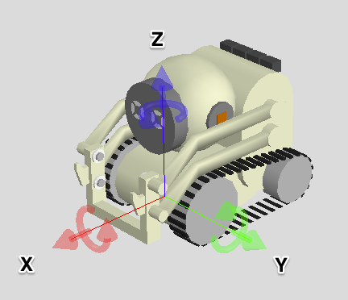

## Poses

### Quick Summary

* Poses contain position information and consist of
  * 	A `Transform` which specifies a rotation and a translation
  * A "parent" pointer indicating what that `Transform` is with respect to
* Kinematic chains and trees can be created using the parent pointer
* Care must be taken to keep these chains and trees valid (parents must outlive their children). This is largely maintained/monitored under the hood using shared pointers.
* We use discrete PoseStates to represent "uncertainty":
  *  `Known` : "accurate" / "trusted"
  *  `Dirty` : "inaccurate" / "untrusted" (e.g. not suitable for doing localization)
*  Objects must be observed multiple times in roughly the same location to be "confirmed" and reported to the rest of the system

---

(The robot's origin is located at the point halfway between the two front wheels)

The pose of an object (including the robot) represents its position with respect to (w.r.t.) its "parent" coordinate frame. Poses are simply a 2D or 3D Transform plus a  "parent" pose. Note that Poses only know about their parents, not their children. 

A Transform is made up of a rotation and translation and can be "applied to" points, quads, rectangles, etc, or "composed with" another Transform via multiplication. 

* `Transform2D` stores a two-dimensional translation vector and a single angle representing rotation in the plane.
* `Transform3D` stores a three-dimensional translation vector and a `Rotation3D` (which internally uses `UnitQuaternions`) to represent three-axis rotation. Note that various forms of 3D rotation (and conversions between them) are available in coretech math: `RotationVector3d` (angle + axis), `RotationMatrix3d`, as well as quaternions.

Mathematically speaking, multiplying a 3D Transform comprised of 3x3 rotation matrix `R` and 3-vector `t` by 3-vector \[x y z\] is as follows:

[x y z]T = [R3x3 | t3x1] * [x y z 1]T

### Pose Chains and Trees

As mentioned above, an important and frequently-used capability of Poses (versus raw Transforms) is that they can be "chained" via their parent pointers. Thus they can represent kinematic chains. The relative positions of poses within the same chain or tree w.r.t. one another can be queried via their `GetWithRespectTo()` and `GetWithRespectToRoot()` methods. This is how, for example, we compute the position in world coordinates of an object observed by the camera. The observation's pose is made with w.r.t. the camera, whose pose is relative to the head, which is at a particular angle, and which is attached to a robot at a particular position in the world. Using GetWithRespectTo does the coordinate frame transformation math for you.

Internally, these trees are made up of `PoseTreeNodes`, each possessing a shared pointer to its parent. The actual tree, however, is "hidden" as part of the private implementation of the Pose2d/3d classes, using the templated `PoseBase` class from which they each derive. The actual Pose2d/3d objects generally used in the code are thin wrappers around PoseTreeNodes. All this complexity was added to help avoid/catch hard-to-diagnose crashes caused by the (unfortunate) initial use of raw pointers for Pose parents, (a) without having to rewrite all the many systems relying on pose objects, and (b) without exposing some new PoseManager or other implementation detail which all those systems would then need to know about.

In general, care should be taken to create and maintain valid pose trees. This largely means parents should always outlive their children (a common source of bugs). The hidden tree of shared pointers should catch errors here with various asserts. For example, you may get an assertion failure that the last wrapper or "owner" of a node is being destroyed but that the node is still in use as a parent of another pose. These errors suggest that you are likely using a temporary object as a pose parent somehow and that parent is being destructed or going out of scope before its child. (Future attempts to derefernce the child's pointer would then be dangerous.) This could be due to accidental copies (e.g. in a lambda capture), for example. An indication that a copy is the source of the problem is that the pose's name has `_COPY` appended to it.

### Pose states

Object pose estimates are not perfect.  In lieu of trying to fully represent uncertainty in 2D or 3D space, we have a discrete notion of uncertainty: the Pose State. This is far from ideal in many situations, but is also far simpler than trying to represent a distribution over 6DoF pose, for example.

In practice this means that we split poses into two states: Known and Dirty. Known roughly corresponds to "accurate" or "trusted". Dirty effectively means "uncertain" or "untrusted". Note that when the pose of an object is "Unknown", it simply does not exist as a Located Object in [BlockWorld](blockWorld.md), so there is no explicit "Unknown" Pose State.

Some things that can lead to Dirty poses:

* Seeing an object from "too far away" (this is currently just a fixed distance threshold, but could eventually be tied to the size of its marker)
* Seeing an object while the robot was moving
* Receiving indication from an active object that it was moved

If we already have an object's pose in Known state, we do not update it with a new observation that would yield a Dirty pose state.

One of the primary uses of separting "Known" from "Dirty" is that the robot will not use the object to localize itself or to [Rejigger](blockWorld.md) origins if its pose is Dirty. 

### Pose Confirmation

It is the job of the ObjectPoseConfirmer to decide when we have "confirmed" a new pose for an object, regardless of state. (We can "confirm" an object to be in a Dirty pose if we see it from far away.)  The need for pose confirmation arises mainly from false positive detections by the vision system. We therefore use multiple, consistent observations as a proxy for confirmation. Poses of objects in [BlockWorld](blockWorld.md) are only updated once confirmed, so in practice you do not need to concern yourself too much with confirmation; if you get an object from BlockWorld and reason about it's pose, it has already been confirmed.

