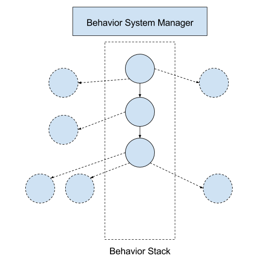

# The Behavior Tree

Created by Kevin Karol Last updated Oct 19, 2017

## Terminology: Behavior System Manager, Behavior Stack, and the Behavior Tree 

As established in [Behavior Component Overview] the Behavior System Manager (BSM) is the lowest level of the Behavior Component before behaviors are loaded in from data. In Victor the BSM maintains active behaviors as a stack. As a result BSM is used to refer to the class which manages the behavior stack, but when thinking about active behaviors it's effective to think of it as a stack. Behaviors can delegate to other behaviors, and by nesting behaviors inside each other it's possible to create increasingly complex emergent behaviors for Victor to perform. In effect there is one behavior that serves as the root of all others, and each of its delegates can be considered leaves of a tree which can then have leaves of its own. Behaviors loaded in from data are therefore linked together as a tree of possible delegates - they delegate through the behavior system manage which pushes the new behavior onto the stack thereby giving that behavior the ability to run actions on the robot or to delegate even further down the behavior tree.

Figure 1: BSM, Behavior Stack and Behavior Tree

Figure 1 displays the differences between the behavior system manager which maintains the behavior stack, behaviors which are in the behavior stack, and behaviors which are delegates that could be delegated to, thereby becoming part of the stack. Transitioning between being included as a possible delegate, as part of the stack, and as the behavior that can delegate is information that is provided to a behavior through the function calls outlined in the Behavior Lifecycle Overview. Figure 2 is provided as a visualization of what a raw behavior tree looks like loaded in from data. In both figures the stack and tree are visualized top to bottom.

Figure 2: Example Behavior Tree

##Behaviors as Independent Units

One of the key paradigms that the Victor behavior system is designed to support is the concept of behaviors as independent units that can be arbitrarily re-configured within the behavior tree. While in practice this is likely an unachievable goal it's a great design goal to think about when considering how to make decisions related to parametrizing behaviors and how behaviors make decisions using external data. For example, if you're designing a behavior that wraps Build a Pyramid with custom lights for each stage you likely don't want to have data defined parameters for what behaviors you're delegating to - it's inherent to the behavior you're building that it delegates to the Build Pyramid behavior. However, if you're building a behavior that reacts to a stimulus by playing an animation, the specific stimulus and animation could definitely be data defined. In both of these cases the behavior, one of which has inherent properties about the behavior it delegates to and one which has configurable properties about what it's reacting to, have been built such that they could be moved around the tree without silently breaking. On the other hand, if you were to create a behavior that relies on the behavior above it starting up an AI Information Analyzer process, this behavior would break if it were moved elsewhere in the behavior tree. Instead, the behavior should start the AI Information Analyzer process within one of its lifecycle functions so that it could safely be used without its parent.