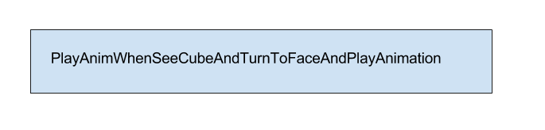
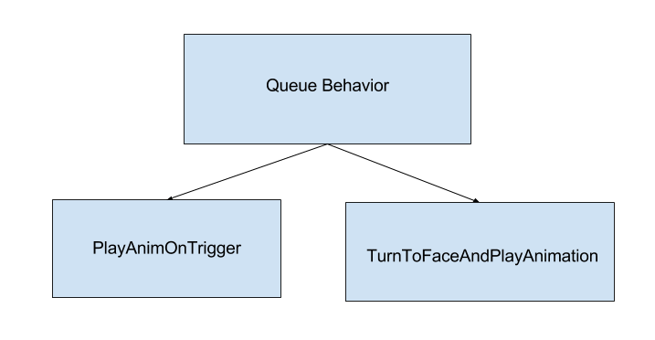

# How Data Drives Behaviors

Created by Kevin Karol Nov 30, 2017

## What is a behavior?
As addressed in the Behavior Component Overview, behaviors are just a bundling together of actions and messages to various game systems which, to the end user, create a coherent experience. From a technical perspective, how is this bundling implemented? While there are plenty of ways to skin this particular cat, the victor behavior component relies on a heavily data driven architecture. This provides a couple of key advantages:

1. It's possible to create multiple instances of the same core behavior with slightly different parameters. Want two versions of victor interacting with the user, one of which appears sleepy and one which appears excited? Rather than duplicating the work of tying the actions together, just create a new data defined instance of the behavior which has different animations or motion profiles
2. It's easy to change the conditions that trigger a behavior. If "Cozmo does X in response to Y" had to be coded by hand for every combination of X and Y there would be an explosion of classes that had to be maintained by hand. If X and Y can be data defined, it becomes much easier to change how cozmo operates with minimal danger of breaking a behavior or introducing bugs
3. It's easy to clear out victor's behavior for special case behavior. If behavior transitions are hard coded in rather than data defined it becomes very difficult to sandbox victor for situations like SDK interactions which may not want standard behavior transitions.

## Advantages Example

The process of determining what about a behavior should be data defined and what should be hard coded into the behavior is more an art than a science. The fundamental question in making the decision should be "Is this INHERENT to the behavior operating as expected".

For example, let's look at the ways to write a behavior "Example" that has 4 states

1. Victor sees a cube
2. Victor plays an animation
3. Victor turns to the user's face
4. Victor plays an animation

A naive way to implement this behavior would be as a single hard coded unit that encompasses all steps:

Figure 1: Uhhhhhhhh no. Please don't do this

Instead, let's look at breaking down the 4 states into units which might be used elsewhere in the behavior system. First off, two of the steps are to play an animation, so we should be able to encapsulate that with one behavior that has two instances with a different animation parameter. Next, there's the step of turning to the user's face. This could also be considered a standalone step. Finally, we can wrap these three steps inside a "queue" behavior which takes in three data defined behavior instances and runs them in sequence.

Figure 2: One behavior per step

With this example we've used the fact that behaviors are instantiated through data definitions in order to create 3 behavior types (PlayAnimation, TurnToFace, RunInQueue) which could be used in totally separate contexts and strung them together with appropriate parameters to have the effect of the single "behavior" described above.

We could take this a step further and say that the process of "PlayAnimationOnTrigger" is a general concept that could be used elsewhere in the system (in this case the trigger of see cube and the animation to play would both be defined in data). Additionally, the process of turning to the user and playing an animation is likely a useful unit elsewhere in the system (in this case the face to turn to and the animation to play could both be defined in data). 

Figure 3: Behaviors with Data Driven Conditionals

In this third instance we've reduced the number of independent behaviors/steps required but still kept the behaviors as general re-usable units while the specifics that make it unique are set in data.

## Behavior Classes vs Behavior IDs

Within the behavior system the distinction between hard coded classes and data defined instances is referred to as the BehaviorClass and the BehaviorID. Each BehaviorClass enum has one and only one .h/.cpp class definition associated with it. A BehaviorID is associated with one and only one json file that specifies the BehaviorClass the behavior is an instance of as well as the custom parameters that should be applied to that class. Within Figures 2 and 3 above "Example" would be the behaviorID and its parameters would be defined in a json file called Example.json. Within this file the BehaviorClass would be defined as QueueBehavior and the BehaviorIDs for the specific sub behaviors would be parameters of the QueueBehavior class. 

When behaviors refer to each other they almost always refer to each other via BehaviorID because they are not referring to the process of turning to a face and playing an animation, but rather the specific BehaviorID instance which specifies the appropriate animation to play after turning to the face. This is actually how the entire victor behavior tree is built - by linking behaviors to their delegates by BehaviorID.

## "Core" Behaviors vs "Designed" Behaviors

While they are not terms used within the actual behavior component code base, it can be useful when building a new behavior to determine whether it is a "Core" behavior or a "Designed" behavior. A "Core" behavior is one which defines a highly reusable set of actions and which it would likely be useful to parametrize intelligently. A "Designed" behavior is one which requires its own BehaviorClass due to complex state interactions with cube lights, audio, or UI but which otherwise primarily wraps "Core" behaviors. These "Designed" behaviors generally aren't worth parameterizing since what is "INHERENT" to the behavior is the exact parameters which would normally be the thing that becomes data defined.