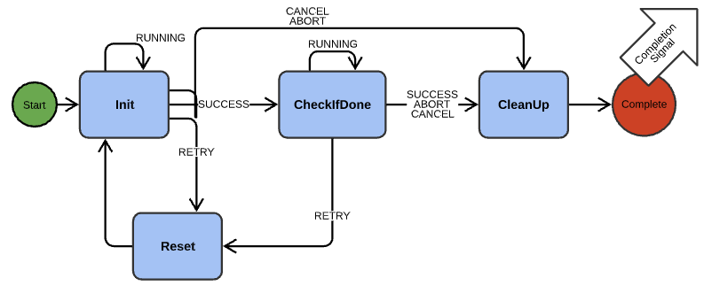

# Actions
Created by Andrew Stein Aug 16, 2017

Actions are intended to provide a common interface for having Cozmo do some discrete motion or action, from simple motions like moving his head to a certain angle, to more complicated coordinated things like docking with a cube or driving up a ramp. By using a common interface they can be sequenced and composed into complex behaviors.

These actions are exposed in the Cozmo SDK to allow developers to create complex behaviors and games for the robot.

## Containers: ActionLists and ActionQueues

At the top level, the Robot has a list of actions to be run concurrently, called an ActionList.  Each "slot" in the ActionList is actually an ActionQueue, which is a set of actions to be run sequentially. 

A message interface for interacting with and queuing Actions can be found in UiMessagesU2G.clad. (For example: QueueSingleAction and QueueCompoundAction.)

## Base class: IActionRunner

Inside the ActionQueue is a list of IActionRunner objects. IActionRunner defines the common interface for both simple actions and compound actions (below). They are ticked forward by their Update() method and also provide a Cancel() method to interrupt a running action. They also offer methods to be run when completed (or cancelled) via Cleanup() and they provide automatic retry ability. They can also "lock" the head, lift, and/or wheels, to indicate that the user should not be able to command those sub-systems while this action is executing. (NOTE: the actual implementation of this needs work!) Each also can return an enumerated RobotActionType for use, for example, in communicating what kind of object finished in a message or signal. See actionInterface.h for more details. 

IActionRunners also have ID Tags (just a uint32) for identifying specific instances of actions, allowing finer-grained control than just knowing their RobotActionType. Each IActionRunner receives a unique ID Tag at construction (whose value you can find out using GetTag()), but you can also use SetTag() to force your own value. Two example use cases for ID Tags are:

1. Cancelling: You can specify an ID Tag to Lists' and Queues' Cancel() methods to only cancel a specific action, wherever it exists in the container.
2. Completion Checking: The Completion Signal emitted by an IActionRunner will contain its Tag, so you can more accurately match which action just completed if necessary.
Note that you can specify an ID Tag when you use QueueSingleAction and QueueCompoundAction messages to queue actions as well (since you can't know the auto-generated Tag created inside the engine when using the messaging interface).

## Basic Interface: IAction
IAction derives from IActionRunner and is the interface for "basic" (non-compound) actions, from which most action classes will derive. Once they start running, updating them calls their Init() method until it returns success. Then they call CheckIfDone() until it returns success. When either fails, they will abort or trigger a retry if desired. If a retry is triggered, Reset() is called and then they go back to Init(). After any completion – success, failure, or cancel – Cleanup() is called and a completion signal is emitted. Different wait times between these steps can also be provided. All of the specific behavior for a new Action derived from IAction is provided by overriding the class's virtual methods.

## CompoundActions
ICompoundAction also derives from IActionRunner and has two subclasses: CompoundActionSequential and CompoundActionParallel. As their names suggest, these are single Actions that internally possess a set of actions to either be run sequentially or in parallel. Note that completion signals are triggered only for the entire compound action, not for each constituent.

Example Action Hierarchy (as of August 2017)
This architecture allows for arbitrarily complex compositions of actions. For example you can have a list of multiple concurrently-running queues that are themselves made of single actions or sequential/parallel compound actions. Some examples of existing actions and their inheritance structure is provided below:

 