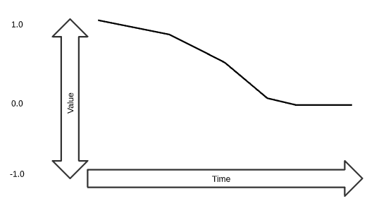
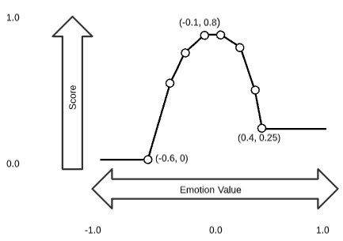
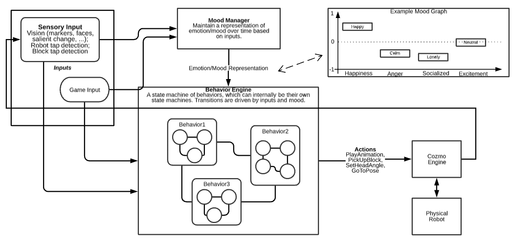
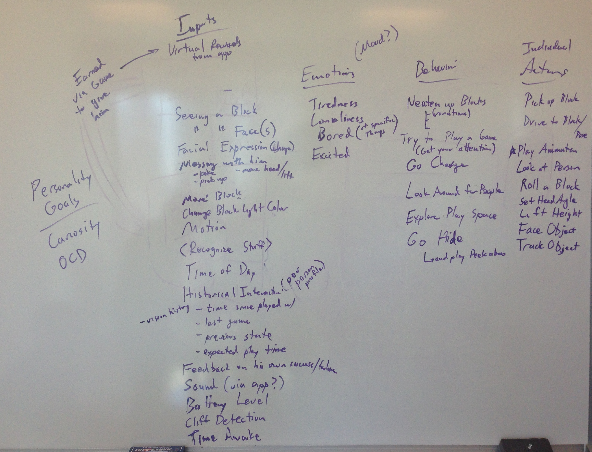

# Emotion / Behavior Architecture

Created by Andrew Stein Last updated Apr 24, 2017

# Glossary of Terms:
These are in ascending order of duration and complexity, where generally each item is composed of multiple of the simpler level along with some additional logic:

* Animation: a series of open-loop movements, sounds and/or 2D face animation played in sequence for a set period of time, delivered as keyframes streamed directly to the robot. These do not respond to sensory input.
    * E.g. Smile, Frown, Celebration Dance, Sigh, Shocked
* "Idle" Animation: plays continuously if no other animations are being played, just to keep him looking alive. 
    * Any "canned" animation can be used as Cozmo's idle animation.
    * Cozmo also has a special "live" idle animation which consists of procedurally-generated random keyframes (potentially correlated to sensor events in the future).
* Action: a series of animations and/or procedural movement / turning to achieve a simple goal
    * E.g. Drive to Position, Pick Up a Block, Place a Block, Face an Object, Dock with Charger, Play Animation / Sound
* Behavior: a set of actions, with state machine, triggers, and other logic controlling which actions to play and when, generally in order to achieve some objective. For example:
    * In `OCD` behavior, the robot's objective is to keep his blocks "neat". He uses GoToPose, PickUpBlock, etc, actions to achieve that objective and plays animations along the way, based on his emotional state and other inputs.
    * In `InteractWithFaces` behavior, the robot's objective is to make a connection and interact with a person, e.g. by mimicking their face. He uses face observation inputs inputs to do so.
    * In `AskForBlock` behavior, the robot's objective is to get a person to give him a block. He uses face observation inputs, animations (like raising his lift and making a sound), and a docking action to do so. 
* Mini-game: 
    * E.g. Vortex, Hamster Mode
* App:
    * The entire app, persistent storage so not limited to singular app-run

## Mood Manager

The goal of Mood Manager is to track the ongoing internal "emotional" state of the robot, independent of the currentbehavior, action, or game. The idea is to reduce repetition and to allow things to have an ongoing effect on Cozmo via their modification of his mood.

We define Cozmo's "mood" to be comprised of a set of emotions. We consider emotions to cover both standard human emotions (a la Aristotle or Plutchik, e.g. happiness), and any other similar attributes that we wish to affect through interaction and have them drive behaviors (e.g. game ranking).

Emotions are all tracked internally as a float from -1 to 1, where generally 0 is a default baseline, positive values are a positive emotion (e.g. happiness) and negative values are the negative version of that emotion (e.g. sadness).

Emotions are tracked historically for the last N seconds, this can be used to detect sudden changes in an emotion (e.g. for determining that there was a recent drop in happiness even though the overall happiness is still relatively high), for debugging purposes this would also help to show interaction over time.

These are the proposed emotions that we'll track for Cozmo, some are global and some are per-entity (blocks / robots / players / ?):

### Global emotions (named as adjectives):

* Happy (vs Sad)
* Calm (vs Angry)
* Brave (vs Scared)
* Confident (vs Shameful)
* Charged - tied directly to battery level, from (1 = full) to (-1 = empty)
* Excited (vs Bored) - (Overall boredom, but we will scale rewards based on "new-ness" of activity etc.)
* Social (vs Lonely)
* Winning (vs Losing) (Game Success - for current mini game session only - maybe directly tied to ranking)
* WantToPlay - driven directly from Unity, how much Cozmo wants to play a minigame (1 = Play it ASAP, -1 = never)

Possible additions:
* Relaxed (vs Stressed)
* Surprised (vs Composed)
* Hope (vs Despair)
* Confused (vs Clear / Coherent)

Per-Entity emotions
* Like (vs Hate)
* Appreciate (vs Envy) (could e.g. drive anger or taunts to specific opponents, e.g. against those who beat them)

Possible additions:
* Enchanted (vs Disgusted)

## Emotion influence
Cozmo's underlying emotional state is maintained independently of the behavior he's executing, but it can beinfluenced byinputs and behaviors. The Mood Manager will provide an input for adding/subtracting from a given emotion:

* e.g: MoodManager::AddToEmotion( emotionType, float value, const char* uniqueIdString ) 
* Calls to this can be made directly from any of app/mini-game/behaviors/actors/animations, and any other detected "events" (e.g. heard loud noise, felt large movement).
* The uniqueIdString parameter is required so that we can uniquely identify between changes of the same emotion, for 2 main purposes:
    * Debug logging (to e.g. say "why" that emotion was increased, e.g. "WonGame") - this will make it easier to view an event timeline and understand what happened.
    * The MoodManager will modify the value based on recency and repetition - e.g. if showing a block to Cozmo added 0.1 happiness generally, showing the block 5 times in a row shouldn't add (5 * 0.1) but each subsequent showing would reduce the reward e.g. Cozmo would instead receive (0.1 + 0.05 + 0.025 + 0.01 + 0), this will initially be exposed via graph(s) for time recency and number in last N seconds vs a multiplier.

## Emotion drop-off

Some emotion values are tied directly to another tangible value (e.g. battery level), most others have a tendency to change over time, these will be controlled via per-type graphs (with e.g. 8 or 16 sample points) to allow for any form of drop-off (e.g. none, linear, exponential, stepped, cliff, etc.):

## Goals
See this doc: https://docs.google.com/a/anki.com/drawings/d/1GwOOPsC8CZscyuqg_1zXiL3O23lVdnbEgGn9XrBk1p4/edit?usp=sharing

## Behavior Selection

Only one behavior may be run at a time. Therefore, we need a mechanism for selecting which behavior to run at any given time. This may be driven entirely by Cozmo's mood, or by a combination of mood and the state of the world (which can include the existence of blocks, faces, other robots, or anything else Cozmo knows about). Each behavior is responsible for issuing a "bid" in the form of a score indicating how strongly it wants to be run, based on mood and/or state of the world. 

## Behavior Selection - Emotion Scoring

* Each behavior is responsible for scoring itself based on the current emotion state and/or the recent change in emotion state, where the score is a float in the 0="never" to 1="perfect match" range.
* To prevent scores that track many emotions being penalized versus those that track very few, the overall score is the average (not the product) of the scores for each emotion that it cares about (other emotions have no effect on the scoring for that behavior), if any single emotion scores 0 however then the overall score is force to 0.
* Behaviors can optionally override the scoring to include additional checks as well as (or instead of) the emotion scoring (e.g. OCD behavior could score primarily on block or other world state - e.g. return 0 if there are no messy blocks, and 1 if there are many blocks to tidy)
( The score for each emotion is derived from a point graph that maps emotion (-1..1) to score (0..1), e.g:
    * an 8 point graph scorer that returns 0 for emotions (< -0.6), 0.25 for >0.4, and linearly interpolates the other values (scoring 0.8 at the highest part):

* Scoring for emotion deltas works in almost exactly the same way, except that the delta for any specific emotion can range from -2 to +2 (e.g. if the emotion rose from -1 to 1).

## Behavior Selection - Behavior Chooser

* Only one behavior may be run at a time. Therefore, we need a mechanism for selecting which behavior to run at any given time. This may be driven entirely by Cozmo's mood, or by a combination of mood and the state of the world (which can include the existence of blocks, faces, other robots, or anything else Cozmo knows about). 
* Each behavior is responsible for issuing a "bid" in the form of a score indicating how strongly it wants to be run, based on mood (as discussed above) and the state of the world, if needed.
* A behavior score of 0.0 is always considered un-runnable and the behavior is skipped.
    * E.g., the OCD behavior is only runnable if there are at least two "messy" blocks present.
* All currently-runnable behaviors are scored (as above), and each is then additionally modified:
    * A scaled random number is added (e.g. "kRandomFactor * randomInZeroToOneRange()", where kRandomFactor = 0.1, would give ~10% to give a slight randomness to the behavior chosen but still favoring higher scores)
    * A multiplier (0..1) that scales based on recency that this behavior was played (the more recently played a behavior the lower the score) - this is used to encourage variety in behaviors
* Behaviors are responsible for handling requests to finish (to allow new behavior to begin) - failure to implement this just means that the other behavior won't begin until this behavior is complete
* External systems (e.g. mini-games) can request a behavior to run with a priority - higher priority behaviors automatically trump anything being randomly chosen
* Higher priority Behaviors can temporarily yield to allow an emotion-driven behavior to run before re-enabling. (e.g. mini-game detects a failure, modifies emotions, yields behavior to trigger an appropriate behavior given current emotions, then resumes with game immediately afterwards).

## Behavior Implementation

The behavior system will live entirely in C++, but we will likely provide a C# interface where C# / Unity can asynchronously control a dummy C++ behavior by:

* Sending messages to:
    * request creation of a C++ behavior
    * request actions to play
    * dictate score for selection
    * dictate emotion rewards
* Receiving messages to:
    * retrieve handle to the new behavior (passed in with all future messages so C++ can associate with the correct behavior)
    * indicate success / failure of requested actions
    * indicate success / failure of behavior running

Whilst complex behaviors will require custom code and should implement a new class overriding IBehavior, basic behaviors should be definable via data (e.g. a Json file), by defining:

* ID (name, converted to unique id via string-map)
* Behavior Archetype (e.g. Play Animation)
* Arguments for the behavior (e.g. Animation name)
* Emotion scoring: a set of tuples for each per emotion(s) cared about containing:
    * Emotion Type
    * Emotion Scoring Graph
* Emotion rewards: a set of tuples for each emotion affected by completion of the behavior:
    * Emotion Type
    * Reward Value

## Proposed Implementation Rollout

### First Look (~ 10 days) [Complete]
1. Add Graph Evaluator to Util (contains N 2D (X,Y) points, given input X returns lerped Y) + unit tests (1 day) [Complete]
2. Add basic Mood manager (1 day) [Complete]
3. Add basic Global emotion class + enum (2 days) [Complete]
4. Drive emotion - add some initial hooks (2+ days) (would be good to get help / suggestions for good places in code where we already detect any interesting events) [Complete]
5. Emotion decay - 1 day [Complete]
6. Behavior scoring - interface and default scoring of emotions vs graph - 2 days [Complete]
7. Behavior selection - use scoring, add randomness, pick best - 1 day [Complete]

### Improved Iteration (data-driven) and Debug-ability (~15 days) [Complete]
1. In-app Mood debug draw (2 days) [Complete]
2. JSON parsing for Graph Evaluator + unit tests (1 day) [Complete]
3. Data driven mood scoring (1 day) [Complete]
4. Data driven decay graphs (1 day) [Complete]
5. Data driven emotion events (2 days) [Complete]
6. Behavior Factory (2 days) [Complete]
7. Data driven behavior creation (2 days) [Complete]
8. Penalize repeated emotion effectors (2 days) [Complete]
9. Penalize repeated behavior selection (2 days) [Complete]

### Improved Depth (?? days) [Not Started]

1. Lots more emotion events (? days)
2. Lots more behaviors, animations, etc. (? days)
3. Behavior modification - have at least 1 behavior, action or animation behave differently (procedurally or logically) based on emotion levels. (TBD)
4. Add per-entity emotions (3 days)

## Brainstorming Session on 7/5/15, with Andrew, Brad, Mark W, and Kevin:

