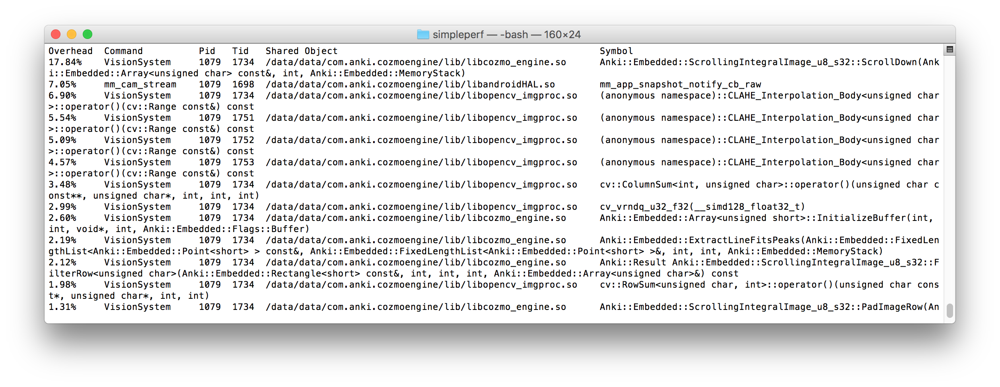
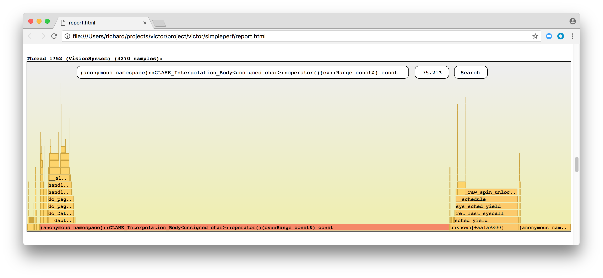
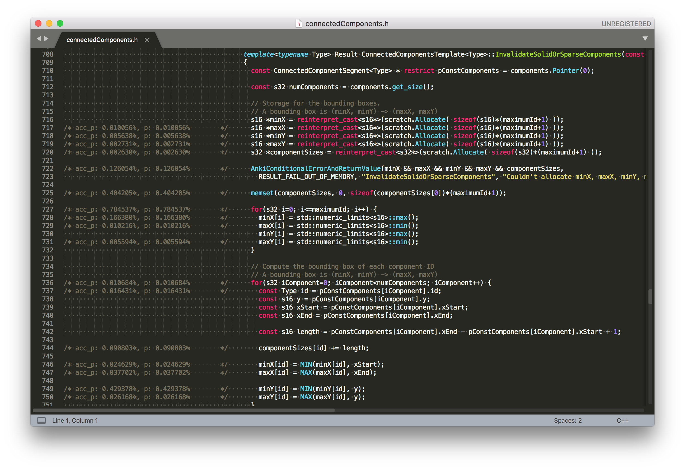
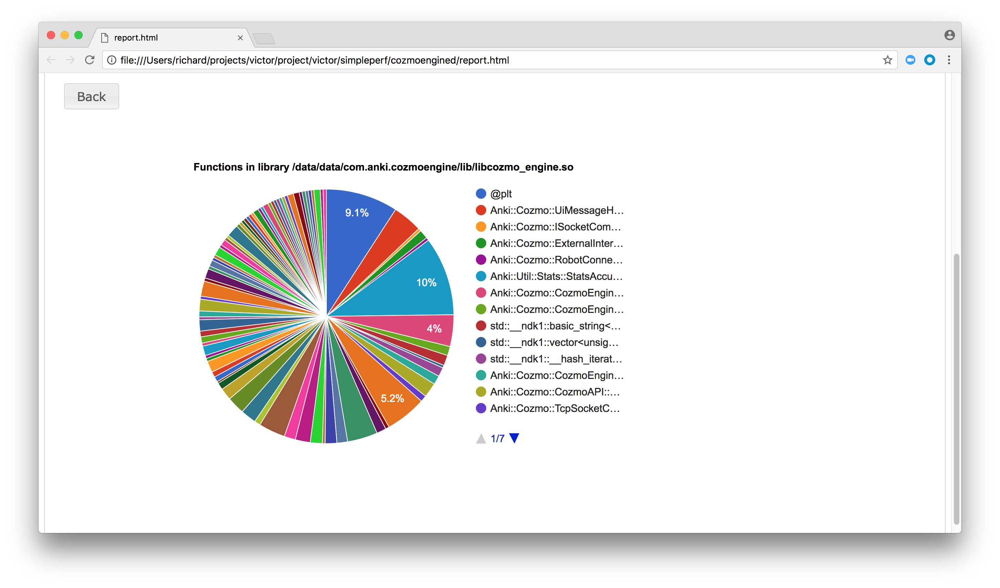
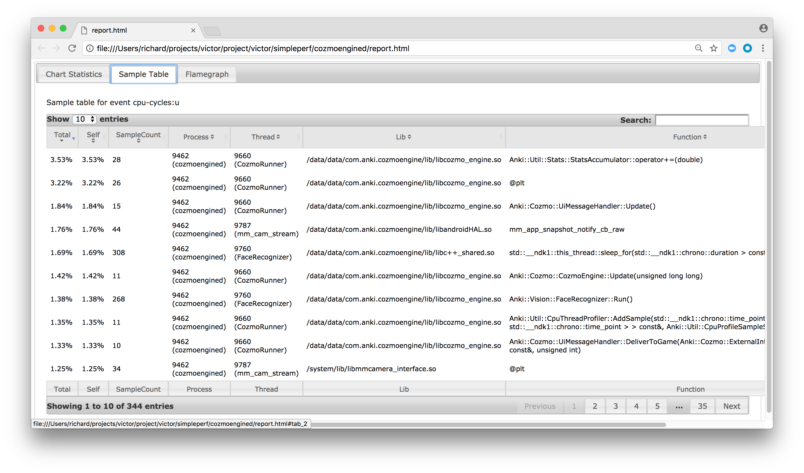
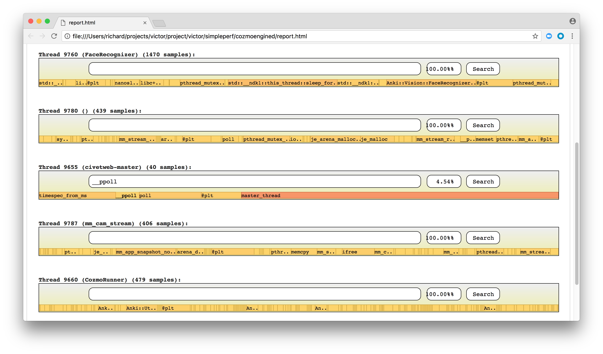
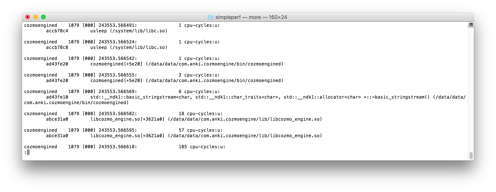

# Victor Profiling

Profiling on Victor is based on [simpleperf](../../project/victor/simpleperf/README.md).

## Prerequisites

### Robot
SimplePerf *only works* if you have a special non-MP robot that does not have debug fuses blown. Ask someone on the engine / OS team if you need one

### Useful Aliases

This documentation assumes that you are using alias commands from [usefulALiases.sh](../../project/victor/scripts/usefulALiases.sh).

If you are not already using these aliases, you can load them into your development shell:

```bash
cd <repo>/project/victor/scripts
source usefulALiases.sh
```

### ADB

Simpleperf relies on ADB to transfer data and execute commands on the robot.

Android development tools are not installed by the Anki environment, to install adb:
```
brew cask install android-platform-tools
```

If your robot does not allow ADB over tcp, you can enable it by running a command like [this](https://ankiinc.atlassian.net/wiki/spaces/VD/pages/148638114/Victor+Developer+Tips) ON THE ROBOT:

```bash
setprop service.adb.tcp.port 5555
systemctl restart adbd
```

And to make it permanent:
```bash
setprop persist.adb.tcp.port 5555
systemctl restart adbd
```

You can make this change persistent by running a command like this ON THE ROBOT:

```sh
setprop persist.adb.tcp.port 5555
systemctl restart adbd
```

The persistent setting is stored in /data/persist.  It will be lost if you reformat /data.

If you have not already connected to ADB on the robot, you can connect by running a command like this
ON YOUR DEVELOPMENT HOST:

```bash
adb connect <robot IP>
```

### Working Directory

This documentation assumes that you are working in [project/victor/simpleperf](../../project/victor/simpleperf)
on your development host.  If you are not already working in this directory, you can change to it by running a
command like this:

```bash
cd <repo>/project/victor/simpleperf
```

## Preparation

Create and deploy a release build:

```bash
victor_build_release
victor_deploy_release
```

Restart robot services:

```bash
victor_start
```

## One-shot recording and reporting

`HOW-simpleperf.sh` recognizes the following environment variables, with default values shown:

```bash
ANKI_PROFILE_PROCNAME=vic-engine
ANKI_PROFILE_DURATION=10 (in seconds)
ANKI_PROFILE_FREQUENCY=4000 (in usec)
ANKI_PROFILE_SYMBOLCACHE=symbol_cache
```

Default values may be overridden as needed:

```bash
ANKI_PROFILE_PROCNAME=vic-anim bash HOW-inferno.sh
```

Current Victor processes are:

* vic-anim
* vic-cloud
* vic-dasmgr
* vic-engine
* vic-gateway
* vic-neuralnets
* vic-robot
* vic-switchboard
* vic-webserver

Additional arguments can be passed to the report generation:

```bash
./HOW-simpleperf.sh --sort tid
./HOW-simpleperf.sh --tids 1734
```

## Recording

Use `./HOW-record.sh` to capture performance data.



Column       |Meaning
-------------|--------
Overhead     |indicates the percentage of the overall samples collected in the corresponding function
Command      |the process from which the samples were collected
Pid          |process id
Tid          |thread id
Shared Object|name of the ELF image/library where the samples came from
Symbol       |unmangled C++ symbol name

## Reporting

Use `./HOW-report.sh` to produce the same output as `./HOW-simpleperf.sh`.

Use `./HOW-report.sh --sort tid` to list threads, most expensive first:

    Cmdline: /data/local/tmp/simpleperf record -e cpu-cycles:u -f 4000 --duration 10 -o /data/local/tmp/perf.data -p 9462
    Arch: arm
    Event: cpu-cycles:u (type 0, config 0)
    Samples: 3418
    Event count: 43896856

    Overhead  Tid
    59.25%    9660
    15.30%    9787
    12.62%    9780
    8.04%     9760
    2.92%     9462
    1.66%     9759
    0.21%     9655

Use `./HOW-report.sh --tids 9660` to view the results for a specific thread:

    Overhead  Command      Pid   Tid   Shared Object                                               Symbol
    5.96%     CozmoRunner  9462  9660  /data/data/com.anki.cozmoengine/lib/libcozmo_engine.so      Anki::Util::Stats::StatsAccumulator::operator+=(double)
    5.43%     CozmoRunner  9462  9660  /data/data/com.anki.cozmoengine/lib/libcozmo_engine.so      @plt
    3.10%     CozmoRunner  9462  9660  /data/data/com.anki.cozmoengine/lib/libcozmo_engine.so      Anki::Cozmo::UiMessageHandler::Update()
    2.40%     CozmoRunner  9462  9660  /data/data/com.anki.cozmoengine/lib/libcozmo_engine.so      Anki::Cozmo::CozmoEngine::Update(unsigned long long)
    2.28%     CozmoRunner  9462  9660  /data/data/com.anki.cozmoengine/lib/libcozmo_engine.so      Anki::Util::CpuThreadProfiler::AddSample(std::__ndk1::chrono::time_point<std::__ndk1::chrono::steady_clock, std::__ndk1::chrono::duration<long long, std::__ndk1::ratio<1ll, 1000000000ll> > > const&, std::__ndk1::chrono::time_point<std::__ndk1::chrono::steady_clock, std::__ndk1::chrono::duration<long long, std::__ndk1::ratio<1ll, 1000000000ll> > > const&, Anki::Util::CpuProfileSampleShared&)
    2.24%     CozmoRunner  9462  9660  /data/data/com.anki.cozmoengine/lib/libcozmo_engine.so      Anki::Cozmo::UiMessageHandler::DeliverToGame(Anki::Cozmo::ExternalInterface::MessageEngineToGame const&, unsigned int)

For different visualizations also try:

* `HOW-inferno.sh`
* `HOW-annotate.sh`
* `HOW-reportchart.sh`
* `HOW-reportsamples.sh`

### [HOW-inferno.sh](../../project/victor/simpleperf/HOW-inferno.sh)

[Inferno](../../lib/util/tools/simpleperf/doc/inferno.md) is a [flame graph](http://www.brendangregg.com/flamegraphs.html) generator.

The width of a flame graph represents 100% of the number of samples, and the height is
related to the number of functions on the stack when sampling occurred.

A flame graph gives you instant vision of the CPU cost centers.
Specific offenders can be found by looking for plateaus.

For example, the most expensive task from the sample below is `CLAHE_Interpolation_Body` (showing in orange)
with another plateau on the right from `_raw_spin_unlock_irq`.



### [HOW-annotate.sh](../../project/victor/simpleperf/HOW-annotate.sh)

It is possible to drill down to the source line level with `HOW-annotate.sh`.
All functions with samples will have the source code annotated where each line will have
its relative percentage of samples reported.



### [HOW-reportchart.sh](../../project/victor/simpleperf/HOW-reportchart.sh)

Combined pie chart, samples and flame graph views.





### [HOW-reportsamples.sh](../../project/victor/simpleperf/HOW-reportsamples.sh)

Output of samples suitable for text processing.

Column       |Meaning
-------------|--------
Shared Object|name of the ELF image/library where the samples came from
Symbol       |unmangled C++ symbol name



## Additional resources

<https://perf.wiki.kernel.org/index.php/Tutorial>
<https://lxr.missinglinkelectronics.com/linux/tools/perf/Documentation>

## Implementation notes

`HOW-simpleperf.sh` is equivalent to

```bash
python ../lib/util/tools/simpleperf/app_profiler.py
       -nc
       -nb
       -np vic-engine
       -r "-e cpu-cycles:u -f 4000 --duration 10"
       -lib symbol_cache
```

The following are arguments to `app_profiler.py`:

|Short name|Long name              |N/A|Description
|----------|-----------------------|---|-----------
|-a        |--activity             |X  |Start an activity before profiling. It restarts the app if the app is already running.
|          |--apk                  |X  |Apk file to recompile the app on Android version <= M.
|          |--arch                 |X  |Select which arch the app is running on, possible values are: arm, arm64, x86, x86_64.
|-bin      |--binary_cache_dir     |   |Path to collected binaries from the device used in profiling data.
|          |--cmd                  |X  |Run a cmd and profile it. Like -cmd "pm -l".
|          |--disable_adb_root     |X  |Force adb to run in non root mode
|-lib      |--native_lib_dir       |   |Path to find debug version of native shared libraries used in the app.
|-p        |--app                  |X  |Profile an Android app, given the package name, such as -p com.example.android.myapp.
|-nb       |--skip_collect_binaries|   |By default we collect binaries used in profiling data from device to binary_cache directory. It can be used to annotate source code. This option skips it.
|-nc       |--skip_recompile       |   |Recompiling java bytecode to native instructions can be skipped if the code has been compiled or you don't need to profile java code.
|-np       |--native_program       |   |Profile a native program.
|-o        |--perf_data_path       |   |The path to store profiling data.
|          |--profile_from_launch  |X  |Profile an activity from initial launch. It should be used with -p, -a, and --arch options.
|-r        |--record_options       |   |Set options for `simpleperf record` command.
|-t        |--test                 |X  |When profiling an Android app, start an instrumentation test before profiling. It restarts the app if the app is already running.

## Anki Profiling

Use `#define ANKI_EMBEDDED_BENCHMARKS` to enable benchmarking within the Vision component.

Use `#define ANKI_VISION_PROFILER` to enable profiling metrics for the Vision system.

When logged to DAS these have the prefix `robot.vision.profiler`

These options can be enabled from the command-line, e.g.

`victor_build_release -DANKI_EMBEDDED_BENCHMARK=1` (embedded benchmarks are enabled)

`victor_build_release` (embedded benchmarks are still enabled as the build is rerun with current options)

`victor_build_release -f` (embedded benchmarks are disabled as the build is reconfigured)
