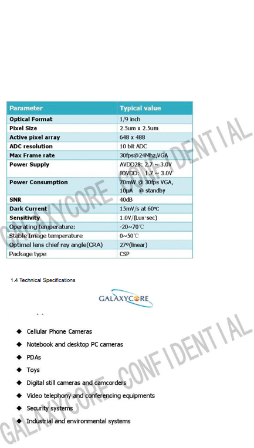

# Camera Focal Length / FOV

Created by Andrew Stein Last updated Feb 28, 2019 

Every Vector's and Cozmo's camera is calibrated at the factory. The focal lengths are fairly consistent, but the lens placement seems can vary somewhat due to the manufacturing process, which can affect the principal point (i.e. where the optical center falls within the image: near – but not exactly at – the center). 

## Cozmo

We run Cozmo's camera at 320x240. It's native resolution is 640x480 (or more precisely, 648x488). The calibrated focal length is roughly 300 pixels, using a 320x240 image. Given that the camera's physical pixels (at native resolution) are 2.5µm in size, we assume a 320x240 pixel is basically double that, or 5µm. That suggests a focal length in metric units of 300 pixels x 5µm/pixel = 1500µm = 1.5mm. 

## Vector
Vector's camera is a 720p camera (1280x720). We generally do most vision processing at half resolution: 640x360. Photos for the "Hey Vector, take a photo" feature are stored at full resolution.

TODO: Same FOV/focal length info for Vector as for Cozmo above.

