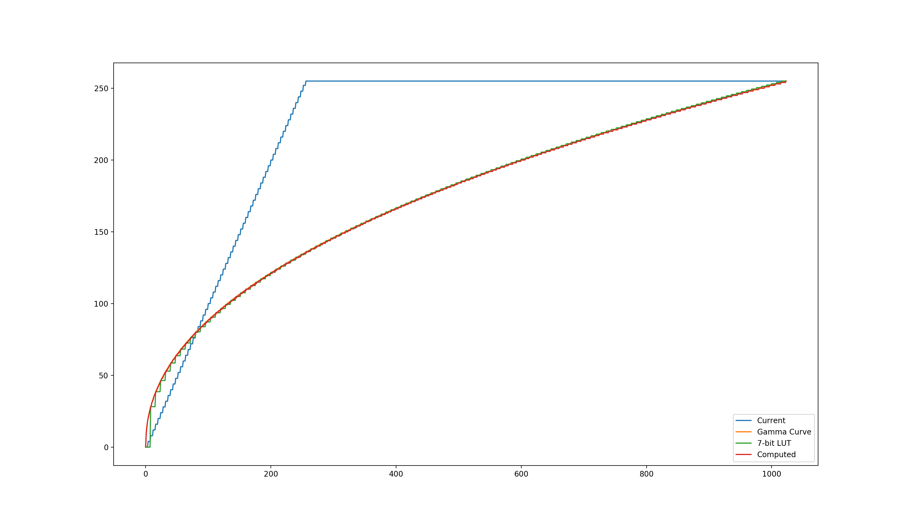
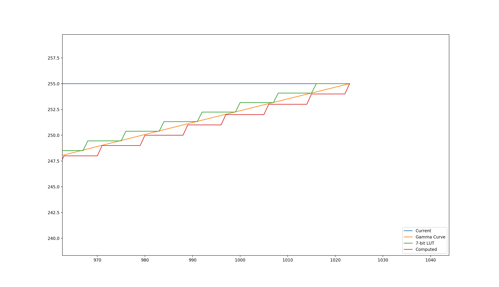
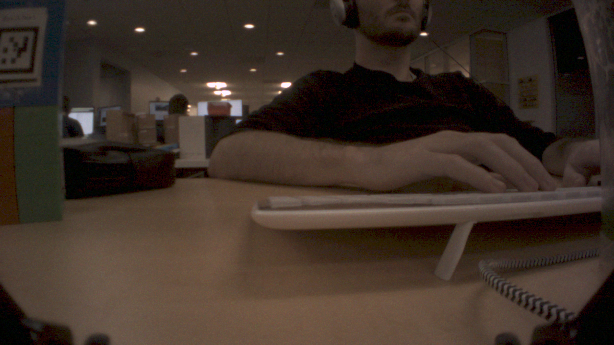

# Debayering

Created by Patrick Doran Mar 06, 2019

Here we will discuss the camera pipeline on Vector and why decisions were made.

## Image Format

Output from the cameras is RGGB10 in RAW10 format. Note, any documentation that says the format from the camera is BGGR10 is inaccurate. The actual input format is RGGB10 where the data is stored in RAW10 format.

## RAW10
This format is efficient storage for cameras that produce 10-bit pixel values by packing four pixels into 5 bytes rather than as in 4 shorts (8 bytes). 

### From the Android Documentation:

In an image buffer with this format, starting from the first pixel of each row, each 4 consecutive pixels are packed into 5 bytes (40 bits). Each one of the first 4 bytes contains the top 8 bits of each pixel, The fifth byte contains the 2 least significant bits of the 4 pixels, the exact layout data for each 4 consecutive pixels is illustrated below (Pi[j] stands for the jth bit of the ith pixel):

|       |bit 7|bit 6|bit 5|bit 4|bit 3|bit 2|bit 1|bit 0|
|-------|-----|-----|-----|-----|-----|-----|-----|-----|
|Byte 0:|P0[9]|P0[8]|P0[7]|P0[6]|P0[5]|P0[4]|P0[3]|P0[2]|
|Byte 1:|P1[9]|P1[8]|P1[7]|P1[6]|P1[5]|P1[4]|P1[3]|P1[2]|
|Byte 2:|P2[9]|P2[8]|P2[7]|P2[6]|P2[5]|P2[4]|P2[3]|P2[2]|
|Byte 3:|P3[9]|P3[8]|P3[7]|P3[6]|P3[5]|P3[4]|P3[3]|P3[2]|
|Byte 4:|P3[1]|P3[0]|P2[1]|P2[0]|P1[1]|P1[0]|P0[1]|P0[0]|

## Bayer Filter

Within the RAW10 byte layout, the image data is stored as a RGGB10 Bayer pattern. That is, the even rows are Red Pixel, Green Pixel while odd rows are Green Pixel, Blue Pixel. Each 2x2 square contains the RGB information for that square and there are several different algorithms (called debayering or demosaicing) for turning the Bayer pattern into an image of many possible formats, though some of the most common ones are RGB888, YUV420p, or Gray. 

## Algorithms
### GPU
Vector has a Qualcomm Snapdragon Adreno(TM) 304. It supports OpenCL 1.1 embedded profile with, among other extensions, the ION host pointer (`cl_qcom_ion_host_ptr`).  This means that we can achieve Zero-Copy with OpenCL; we can operate on memory shared between the GPU and the CPU with no penalty cost other than mapping/unmapping into OpenCL's memory space. This improves speed over having to copy the memory from CPU to GPU.

### GPU Info
```
PLATFORM:
  NAME:         QUALCOMM Snapdragon(TM)
  PROFILE:      EMBEDDED_PROFILE
  VERSION:      OpenCL 1.1 QUALCOMM build: commit #bb26bff changeid #I26c38d39e0 Date: 12/12/17 Tue Local Branch:  Remote Branch:
  VENDOR:       QUALCOMM
  EXTENSIONS:
 
CONTEXT:
  REFERENCE_COUNT:  1
  NUM_DEVICES:      1
  DEVICES:
     QUALCOMM Adreno(TM)
 
--------------------------------------------------------------------------------
DEVICE:
  NAME:                                QUALCOMM Adreno(TM)
  TYPE:
     CPU:                              true
     GPU:                              true
     ACCELERATOR:                      true
     DEFAULT:                          true
  VENDOR:                              QUALCOMM
  VENDOR_ID:                           3209509963
  VERSION:                             OpenCL 1.1 Adreno(TM) 304
  DRIVER_VERSION:                      OpenCL 1.1 QUALCOMM build: commit #bb26bff changeid #I26c38d39e0 Date: 12/12/17 Tue Local Branch:  Remote Branch:  Compiler E031.35.01.00
  OPENCL_C_VERSION:                    OpenCL C 1.1 Adreno(TM) 304
  PROFILE:                             EMBEDDED_PROFILE
  PLATFORM:                            QUALCOMM Snapdragon(TM)
  EXTENSIONS:
     cl_img_egl_image
     cl_khr_byte_addressable_store
     cl_khr_egl_event
     cl_khr_egl_image
     cl_khr_fp16
     cl_khr_gl_sharing
     cl_khr_global_int32_base_atomics
     cl_khr_global_int32_extended_atomics
     cl_khr_local_int32_base_atomics
     cl_khr_local_int32_extended_atomics
     cl_qcom_create_buffer_from_image
     cl_qcom_ext_host_ptr
     cl_qcom_extended_images
     cl_qcom_ion_host_ptr
     cl_qcom_limited_printf
     cl_qcom_perf_hint
 
------------------------------------------
  ADDRESS_BITS:                        32
  AVAILABLE:                           true
  COMPILER_AVAILABLE:                  true
  ENDIAN_LITTLE:                       true
  ERROR_CORRECTION_SUPPORT:            false
  EXECUTION_CAPABILITIES:
     KERNEL:                           true
     NATIVE_KERNEL:                    true
  GLOBAL_MEM_CACHE_SIZE:               4096
  GLOBAL_MEM_CACHE_TYPE:               READ_WRITE_CACHE
  GLOBAL_MEM_CACHELINE_SIZE:           64
  GLOBAL_MEM_SIZE:                     218857472
  HOST_UNIFIED_MEMORY:                 true
  IMAGE_SUPPORT:                       true
  IMAGE2D_MAX_HEIGHT:                  4096
  IMAGE2D_MAX_WIDTH:                   4096
  IMAGE3D_MAX_DEPTH:                   512
  IMAGE3D_MAX_HEIGHT:                  4096
  IMAGE3D_MAX_WIDTH:                   4096
  LOCAL_MEM_SIZE:                      8192
  LOCAL_MEM_TYPE:                      LOCAL
  MAX_CLOCK_FREQUENCY:                 1
  MAX_COMPUTE_UNITS:                   1
  MAX_CONSTANT_ARGS:                   8
  MAX_CONSTANT_BUFFER_SIZE:            4096
  MAX_MEM_ALLOC_SIZE:                  134217728
  MAX_PARAMETER_SIZE:                  256
  MAX_READ_IMAGE_ARGS:                 12
  MAX_SAMPLERS:                        16
  MAX_WORK_ITEM_DIMENSIONS:            3
  MAX_WORK_ITEM_SIZES:                 256 256 256
  MAX_WRITE_IMAGE_ARGS:                4
  MEM_BASE_ADDR_ALIGN:                 512
  MIN_DATA_TYPE_ALIGN_SIZE:            64
  NATIVE_VECTOR_WIDTH_CHAR:            1
  NATIVE_VECTOR_WIDTH_SHORT:           1
  NATIVE_VECTOR_WIDTH_INT:             1
  NATIVE_VECTOR_WIDTH_LONG:            0
  NATIVE_VECTOR_WIDTH_FLOAT:           1
  NATIVE_VECTOR_WIDTH_DOUBLE:          0
  NATIVE_VECTOR_WIDTH_HALF:            1
  PREFFERED_VECTOR_WIDTH_CHAR:         1
  PREFFERED_VECTOR_WIDTH_SHORT:        1
  PREFFERED_VECTOR_WIDTH_INT:          1
  PREFFERED_VECTOR_WIDTH_LONG:         1
  PREFFERED_VECTOR_WIDTH_FLOAT:        1
  PREFFERED_VECTOR_WIDTH_DOUBLE:       0
  PREFFERED_VECTOR_WIDTH_HALF:         1
  PROFILING_TIMER_RESOLUTION:          1000
  QUEUE_PROPERTIES:
     OUT_OF_ORDER_EXEC_MODE_ENABLE:    true
     QUEUE_PROFILING_ENABLE:           true
  HALF_FP_CONFIG:
     DENORM:                           true
     INF_NAN:                          true
     ROUND_TO_NEAREST:                 true
     ROUND_TO_ZERO:                    true
     ROUND_TO_INF:                     true
     FMA:                              true
     SOFT_FLOAT:                       true
  SINGLE_FP_CONFIG:
     DENORM:                           true
     INF_NAN:                          true
     ROUND_TO_NEAREST:                 true
     ROUND_TO_ZERO:                    true
     ROUND_TO_INF:                     true
     FMA:                              true
     SOFT_FLOAT:                       true
  DOUBLE_FP_CONFIG:
     DENORM:                           true
     INF_NAN:                          true
     ROUND_TO_NEAREST:                 true
     ROUND_TO_ZERO:                    true
     ROUND_TO_INF:                     true
     FMA:                              true
```

Implementing debayering on the GPU is fairly simple. The major gotcha's are:

* Use cl::Image2D
    * Single Channel Images
        * Image Format: CL_R, CL_UNORM_INT8
        * On CPU this will be an array of uint8_t (r,r,r,r,...) with values in the range (0,255)
        * On GPU this will be an array of float4 (r,0,0,1) with values in the range (0,1)
    * Three Channel Packed Images
        * Image Format: CL_RGB, CL_UNORM_INT8
        * On CPU this will be an array of uint8_t (r,g,b,r,g,b,...) with values in the range (0,255)
        * On GPU this will be an array of float4 (r,g,b,1) with values in the range (0,1)
* Zero Copy
    * ION Memory is not the most friendly interface to work with
    * Wrap the ION memory in as much way as is possible such that anyone using it doesn't have to deal with allocating/deallocating.
    * To use the OpenCL extension, only a couple of the ION file descriptors are necessary when mapping the memory

The GPU Implementation of debayering is straight-forward. Iterate over 2x2 squares, convert the RAW10 floats (since they're now all floats in the OpenCL kernels) into bytes, convert those into ints, lookup the values in a Gamma table.

### Neon
Neon is a SIMD (single instruction multiple data) architecture extension for Arm processors; it allows for operating on 8 or 16 bytes at a time and can offer speed and power improvements. It is a limited set of instructions that include bitwise operators, basic arithmetic, and data reorganizing among others. Because of the arrangement of bayer image bytes and simplicity of operations with regard to the most basic debayering algorithms (specifically nearest-neighbor), we can make use of it to improve the speed and power consumption of debayering.

#### Original Implementation
The first pass algorithm that shipped with Vector is a very simple rearrangement of 10 consecutive bytes into 8 bytes by dropping the 5th byte of each RAW10 group of 5 bytes. The output response was effectively:

```
# Original
X = (0,1023)
f(x) = (0x000000FC) & X
 
# Corrected for error
f(x) = ((0x000003FC) & X) >> 2
```

The result of doing this can be seen in the chart below. While this an error, to map the 8 upper bits to a linear reponse (Gamma = 1.0), then it is easily corrected as noted above. However, incorporating a variable gamma requires additional instructions.

#### Fast Gamma Correction

Computing gamma is expensive, but it can approximated at a reduced cost. We implemented a neon version of powf that reasonably approximates the value and can be used to compute the gamma corrected value. In order to do this, each RAW10 entry of 5 bytes has to be converted into four 32-bit floats. The response is effectively:

```
# Original
X = (0,1023)
f(x) = floor(255 * (x/1023)^G)
```

This is as accurate we are going to get to the ideal curve from computing the gamma correct value. One significantly problem with this approach is that because we have to convert input values to 32-bit floats as an intermediate value, the Neon instructions can operate on at most 4 input values at a time as opposed to 8 if the values were always single bytes.

#### Lookup Table (Upper 7-Bits)
Computing gamma is expensive, but because we have a limited set of input values we can use a look-up table to find the pre-computed values. However, implementing a LUT using Neon is difficult. Neon has a lookup table instruction, but it can map to at most 32 values per lookup instruction. To get around this limitation, we can limit ourselves to the upper 7-bits and do 4 lookups into the four tables (by subtracting 32 from the input and doing the lookup in the next table). The response is effectively

```
# Original
X = (0,1023)
f(x) = round(255 * ((x>>3)/127)^G)
```

The downside to this approach is that it removes 3 bits of information (8 possible values). So consecutive values in the table are actually 8 values apart. With Gamma > 1.0, this result is a flattening of the darker regions of the images, but a reasonable approximation across most of the input space. This is visualized in the gamma correction graphs.

## Gamma Correction
One of the main causes of this investigation was to rework the debayering algorithm to include gamma correction. This led to discoveries with the GPU power consumption, an existing errors, and gamma curve approximations. Below are graphs of the Gamma curves corresponding to the algorithm implementations below. The target curve is a gamma of 2.2: (255*(x/1023)^G) and minimizing the error between our approximation is the goal.






As can be seen from the graphs; the original debayering algorithm, while wrong in that it was unintended, sort of created a piecewise gamma correction for the input data that inflated the values of the lower end of the input image. Fortunately, the images are dark (by human standards), so artificially pumping up the image is not as bad an error as it could be. The best response curve is done by computing and rounding gamma to the nearest integer. Finally, using a LUT7 that uses the upper 7 bits is a reasonable approximation of the curve, but loses a lot of the subtlety of the lower end of the input values but is faster than directly computing the gamma correction.


|Computed Gamma                  | Gamma with LUT for upper 7 bits| Gamma with LUT for upper 7 bits and 8th bit added|
|--------------------------------|--------------------------------|--------------------------------|
||    ||


### Performance
Performance tests were performed by settings the CPU frequency to 533333 Hz and having a load average of ~1.0. A single files was loaded from disk, copied to 5 separate image buffers, and debayering was performed cycling through the 5 images. This was done to make sure that memory caching wasn't artificially improving the results. The test image was a 1280x720 raw RGGB image (same as seen above). 


|   |GPU (LUT Gamma)|Neon (Computed Gamma)|Neon (LUT7 Gamma)|
|---|---------------|---------------------|-----------------|
|FPS|Amps	S/Frame	|Amps	S/Frame       |	Amps S/Frame    |
|30 |0.153	0.012   |0.134	0.051         |	0.149	0.032|
|15	|0.136	0.011   |0.127	0.052         |	0.122	0.032|
|10	|0.129	0.017   |0.117	0.052         |	0.112	0.032|
|5	|0.112	0.018   |0.105	0.051         |	0.104	0.032|

From the chart above we can see that the GPU debayering implementation is the fastest and perhaps the best option for full-image debayering at 30 frames per second. The Seconds per Frame for the GPU is consistent across loads whereas the NEON implementations are slowed by heavy CPU load. However, the current draw for the GPU is significantly worse, but gets closer for NEON implementations that can achieve 30 FPS. Computing Gamma with Neon, while more accurate than using a Lookup Table, is ~20ms slower but knowing this does provide an upper bound for how slow debayering can be.

### Vector

The biggest factors contributing to our decision regarding debayering with Vector are the current draw (milliamps) and process time (milliseconds). These correspond to power use (lower milliamp value is better) and time until the data is usable (lower milliseconds is better). The CPU load on Vector is already greater than the number of cores on Vector; so running anything on the GPU will always use more power because the GPU would be acting as a "5th core". The only way for this to potentially not be true would be to reduce CPU load across Vector and find a sufficiently complex algorithm that is more power efficient on GPU. All this makes GPU use unrecommended for any simple algorithms that run frequently; the power cost is just too high despite the GPU running completing the algorithms faster and being unaffected by full CPU loads. Arguments can only be made for using the GPU when the cost of timely responsiveness is worth the extra power consumption.

Since the GPU is not really an option, that leaves computing gamma or using the LUT7 approach. By inspection, the LUT7 approach is 'good enough' for doing perception algorithms, faster, and uses less power. The Neon computed approach could still be used for photo-quality images. If we ever want to do more complex debayering and 'prettying' of images, then we should consider moving to the GPU since those are one-off requests that may be worth the extra power consumption.