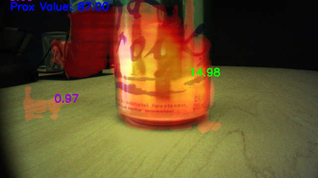
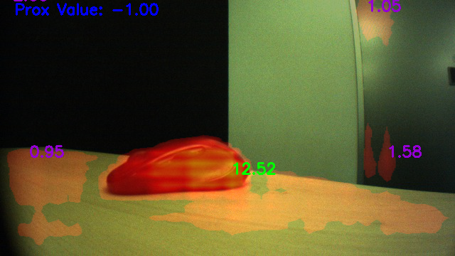
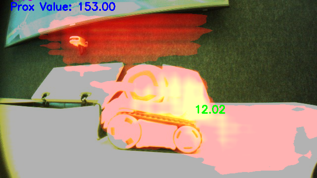

# Objectness

Created by Robert Cosgriff Last updated Mar 01, 2019

Here lives the current status of the work on objectness. The appropriate Jira tickets that were worked on are under this epic I'll start with how we arrived at pursuing this among other things as well as notes on methods tried and the like. The work on objectness fell out of work for object teaching. Which I'll also include here since these were closely aligned for quite some time. Early on in the work for object teaching was divided pretty broadly into localizing the object of interest in the image, and the other detecting/remembering objects that are being taught. The approaches for the most fell into several approaches, all of which are documented along with the papers I found useful with some high level comments here.

After exploring these methods and getting several of them running, and playing around with them with some of our example data. There was only one method looked like it had the potential to provide us with results that we wanted with a potential computation foot print that was acceptable. This was this Pixel Objectness paper. This worked well on our data here are some examples below ... I have added the rest of the results to the following dropbox folder for those interested. It's probably worth noting that this work relates closely to proposal methods that are more broadly used in some networks to generate bounding boxes that are then later classified into objects. These methods included other objectness methods that are well known in literature one example is edgeBoxes. These methods aren't quite what we are looking for, mostly because these methods are meant to generate an over complete set of bounding boxes so that no object is missed, and then these boxes are later combined. In addition most of these techniques live in the bounding box data structure world which (at least at the time) we wanted to live in a world of salient points and thus a "soft" segmentation made more sense for us to generate salient points from. It is fair to argue that bounding boxes could be converted to a accumulator which could be viewed as an inaccurate soft segmentation to draw salient points from, however this is far from ideal. The motivating set of data is here with some examples shown below. 

A brief description of these images is probably worth while. The images below are the "soft" segmentation that I mentioned earlier, specifically the higher the value shown in the heatmap (with overlayed connected component extremum values per component) the higher confidence the network is that that particular pixel is part of an object (human graspable). The image also includes the proximity sensor's (prox) value, for reference of the utility of whether we could use this network to help during appropriate behaviors, namely seeing interesting objects at a distance where the prox doesn't fire. An important note here is that the values that the network outputs are both positive and negative centered about zero. A response with a high magnitude but negative would indicate that the pixel is very likely not an object. These strongly negative values aren't shown in the image and the "response" map is thresholded to zero for all values less than zero before generating these heatmaps. Another bit to note is that the raw values are displayed and can be compared across frames, however each individual heatmap color is relative to that max value in that particular frame. That is to say that the same color values across frames do not correspond to the same numerical values across frames. This is was the raw extremum score is included in the visualization.

The first three images are examples when objectness works well. The last image is indicative of the cases when objectness doesn't work so well. Specifically the way the objectness network is trained now, is it almost always assumes there is some object in the scene and tries to find the extent of its region resulting in strange false positives normally around surfaces when there is no near by object present. There are probably some data set manipulation that can be done to address this, but this is certainly a major drawback of the method at present.

Once the we were happy with the results and accuracy we decided to go forward to try to get this running on the robot. This meant getting an implementation of the objectness network in tensorflow. This was done by fine tuning the deeplabv3+ segmentation network in the manner described in the Pixel Objectness paper. Here are the results of benchmarking the network on the robot. The part of the network that caused the most issues in terms of running time and computational cost was the size of the output segmentation. That is the larger the size (dimensions ... height and width) of the segmentation we want to output the more costly it is to run the network, because the network is in fact larger. 

A more tactical breakdown of the next steps for objectness is discussed here.