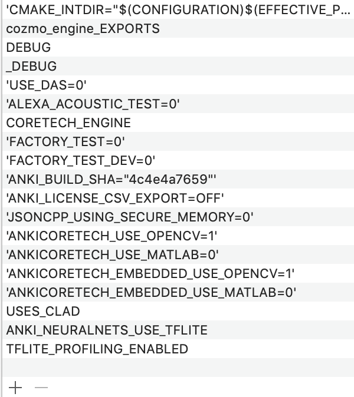
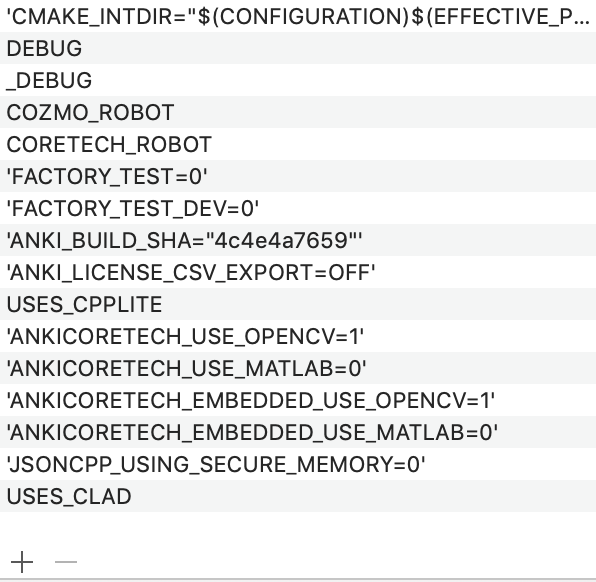

#CLAD
##The "C-Like Algebraic Data" language

###Abstract:
CLAD is a light-weight definition language for defining binary-serializable messages.  The CLAD language uniquely determines the layout, and provides some out of bound type information.

###Details:
Message-passing is the backbone of Anki's software architecture, and has proven to be a huge benefit in terms of modularity, flexibility and safety.
However, writing the code that serializes and deserializes the messages is error-prone and time consuming.  Additionally, the packing and unpacking code is often duplicated, making sweeping optimizations a challenge.

"Protocol Buffers" is a difficult to use and cumbersome utility that supports much more than basic data serialization and the code they generate is not very intelligible.  Adding new environments or custom targets is not easy.

So Anki now has CLAD, the C-Like Algebraic Data to generate light-weight, flexible and human-readable data object wrappers in the programming language of your choice. A small amount of message definition code is needed to uniquely define the messages you wish to pack and unpack, and the emitters use that information to generate the code for you.  This frees you up to think about the what and not the how. 

An [algebraic data type](https://en.wikipedia.org/wiki/Algebraic_data_type) is a mathematically simple method to describe data by combining types in two ways: products, sums and enumerations.  The idea being that it will be easy to reason about and reuse something so simple.

The resulting output will be in the language you need, and will be suitable to check into source control, added to your project and indexed directly by our favorite IDE (to allow for code-completion and straight-forward debugging).

Any new emitter can easily be unit-tested against the other emitters, meaning that the code confidence grows with the square of the number of emitters.

###A System of Two Parts:
1. A LALR parser for the CLAD language, written in Python using PLY (Python Lex/Yacc), which produces an abstract syntax tree full of rich type information.
2. A set of emitters for various languages / environments that walk the abstract syntax tree and print well formatted code, full of useful comments and other helpful utilities, optimized as is appropriate for the target of the emitter.

##CLAD Language Specification:
* A clad file consists of: 
	* enum declarations (like C enums)
	* message declarations (like C structs)
	* union declarations (like C unions + a tag field for type information)

* Enum types:

		 enum int_type EnumName {
		     memberOne,
		     memberTwo = int_const
		     ...
		 }
		  
	* members may have initializers to lock values
	* guaranteed on-the-wire storage size
	* emitter generates type-safe enum suited for your language

* Message types: (composite types, product types)

		message Name {  
		  type MemberOne,
		  type MemberTwo[int_type],
		  type MemberThree[uint_const],
		  ...
		}
		
	* members can be of primitive, variable-array, fixed-array, composite(message) and sum(union) types
	* members are serialized in the order in which they are declared
	* members are packed as tightly as possible, with no space in between members
	* the variable-array type is a 
	* the fixed-array type is a fixed length array with no length field (serialization code assumes the length of the array)
	* emitted code contains pack and unpack methods or functions as appropriate for your language or environment.

* Union types: (sum types / disjunct types / 'or' types)

		union name {
		  type MemberOne,
		  type MemberTwo = int_const,
		  type MemberThree[uint_type],
		  type MemberFour[uint_const] = int_const
		}

		// An autounion contains one of every message included in that file. (use structure for a message that isn't auto-added to implicit auto-unions). A subset of members may have fixed tags defined
		autounion name {
		  type MemberOne = int_const,
		  type MemberTwo = int_const
		}
	
	* members can be of primitive, variable-array, fixed-array, composite(message) and sum(union) types
	* object will be serialized as a *1-byte tag*, follwed immediately by the serialization of the underlying type
		* This could be extended to a larger tag in the future.
		* Syntax should become ```union uint_type name { ``` to match enum.
	* object will typically be represented in memory as the largest of any member (a union in c++ / c)
	* used to 'wrap' a set of messages into a protocol
	* emitted code contains pack and unpack functions, just like the message objects
	* emitted code contains a tag and a GetTag method as is appropriate for your language or environment.
	* Note: if you supply `--output-union-helper-constructors`, each union must have distinct member types. To use
	this param but allow for some unions to contain duplicate member types, declare the union with `dupes_allowed`, as follows
	 ```[union|autounion] dupes_allowed NAME { ... }```

* Primitive types:
    * 'bool' (bool)
    * int_type's
		* 'int_8' (char)
		* 'int_16' (short)
		* 'int_32' (int)
		* 'int_64' (long)
	* uint_type's
		* 'uint_8' (unsigned char)
		* 'uint_16' (unsigned short)
		* 'uint_32' (unsigned int)
		* 'uint_64' (unsigned long)
	* float_type's
		* 'float_32' (single-precision float)
		* 'float_64' (double precision float)

* Array types:
	* variable length arrays:
		* ```type MemberName[int_type]```
		* variable length array, with a length field ```k``` of type ```int_type``` at the beginning followed by _k_ serialized objects of type _int_type_
		* variable array length fields can be specified to have a maximum length like so:
		``` type MemberName[uint_type:uint_const] ```
	* fixed length arrays:
	```type MemberName[uint_const]```
		* fixed length arrays my be of composite or primitive type 
		* (no unions currently)
	

* String types:
	* ```string strName```
	* ```string[int_type] strName```
	* ```string[int_type:uint_const]```
	* implemented as a variable-length array
		* length field followed by a UTF-8 string
	* defaults to uint_8 length
	* emitted code will treat this as a native string as is appropriate for your language or environment.

* Void type (not implemented):
	* looks like an empty message.
	* currently not implemented.

##Implementation
###Parser
* living in the _clad_ directory
* Lexer ```clad/lexer.py```
	* CLAD language tokenizer
	* Contains all CLAD keywords and token definitions
	* Make changes here to add new keywords or constructs that can be matched with regular expressions alone.
	* Input is plain text of a clad source file
	* Outputs tokens to the parser
* Parser ```clad/clad.py```
	* CLAD language parser
	* Uses PLY to describe an LALR parser for the clad language
	* Input is a series of tokens
	* Output is the root of an Abstract Syntax Tree
	* Preprocessing 
		* ```#include``` statements
	* Postprocessing
		* Assign values to enums
		* Assign values to union tags
		* Determine versioning hashes for all type declarations
	* PLY rules
		* production methods begin with p_
		* rule in the initial comment is matched by PLY
		* Takes a parser stack
			* p[0] is the result, p[k] is the kth object on the LHS of the production
			* generally do stuff with p[1-k] and put result into p[0]
	* Abstract Syntax Tree ```clad/ast.py```
		* Represents the 'parse tree'
		* Will be consumed by all emitters
		* All AST Nodes are subclasses of ast.Node
		* Type declarations (enum/message/union) are subclasses of ast.Decl
		* Process the AST using a subclass of 'ast.NodeVisitor' via the Visitor pattern.
		* Use the ASTDebug_emitter to see what's in the tree:
			```$ emitters/ASTDebug_emitter.py -C emitters/tests/src Foo.clad```
			* Generally, emitters filter based on the node-type
			* ```def visit_Decl(self, node, *args, **kwargs)``` will match children of type ```Decl```
			* ```def visit_Decl_subclass(self, node, *args, **kwargs)``` will match children of who are subclasses of type ```Decl```

### Emitters
* All standard emitters live in the _emitters_ directory
* CPP_Emitter.py (_C++11 language emitter_)
	* Output requires ```support/cpp/include``` in include path (for SafeMessageBuffer.h)
	* Output requires ```support/cpp/support/SafeMessageBuffer.cpp``` linkage
	* Requires STL linkage ( i.e. ```std::vector``` )
* CSharp_Emitter.py (_C# language emitter_)
* Python_Emitter.py (_Python 2/3 language emitter_)
	* Output requires ```support/python/msgbuffers.py```
* C_Emitter.py (_Embedded ANSI C language emitter_)
	* Only works on well-aligned CLAD files ( emitter will generate errors )
	* May not be up to date with the latest CLAD features ( but unit tests pass )
* CPPLite_emitter.py (_Embedded CPP language emitter_)
	* Suitable for STL-less environments
	* Only works on well-aligned CLAD files ( emitter will generate errors )
* Fuzz_emitter.py (_Fuzz testing buffer emitter_)
	* Greg's fuzzer.  Probably cool for fuzzing the other emitters.

###Unit Tests
* Currently only emitters are unit tested.
	* Might be a good idea to unit test the parser/ast directly
* tests live in the ```emitters/tests``` directory
	* To run all unit tests: ```make -C emitters/tests```
	* To run specific emitter unit test: ```make -C emitters/tests/<subdir>```

###Consumption
CLAD headers come prepackaged as cmake targets, to use in your executable or library simply add to your `target_link_libraries`

e.g.

```
target_link_libraries(victor_anim
  PRIVATE
  robot_clad
)
```

all the necessary `#defines` and include paths will be specified for you.

To assist debugging CLAD vs CPPLITE there are two `#defines` `USES_CLAD` and `USES_CPPLITE`, these can be easily examined in xcode.

####cozmo_engine


####supervisor


#CPPLITE

"cpplite is for cpp code running on embedded processors - it is a subset of c++ which leaves out the stuff most likely to cause code bloat."

It also places restrictions on message format, e.g. one variable length element, so you can’t have two strings in a message and it must be last item in struct.

The design requirements for cpplite were:

  - the on wire and in memory format of the message are identical
  - that it can be represented as structs with no pointers and can be directly serialized / deserialized with only memcpy

cpplite pre-dates knowledge of [flat-buffers](https://google.github.io/flatbuffers/).
